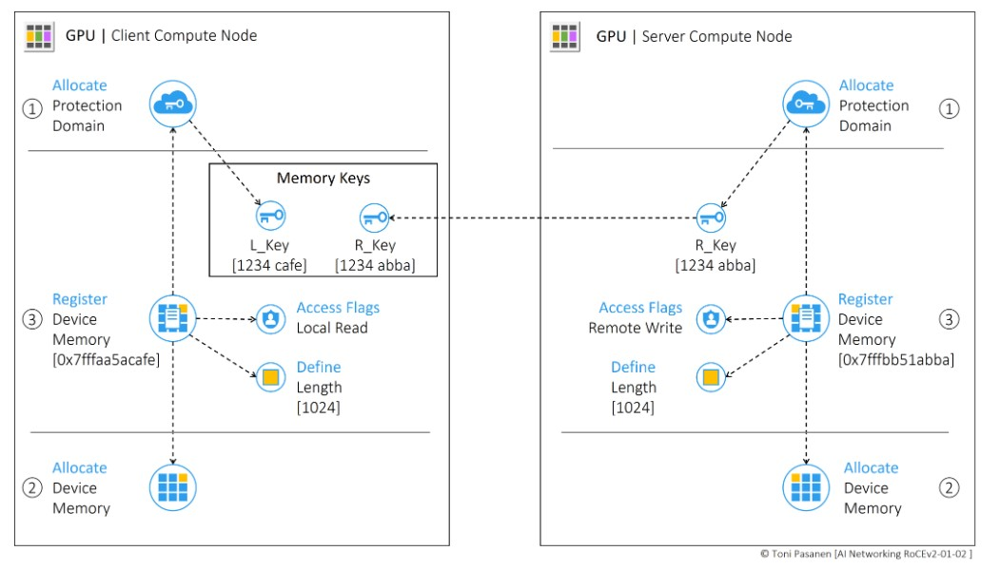
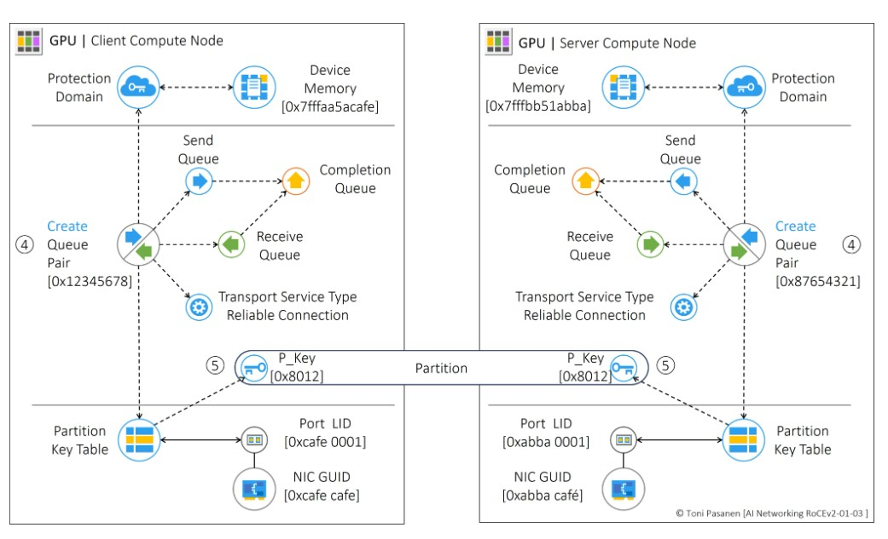
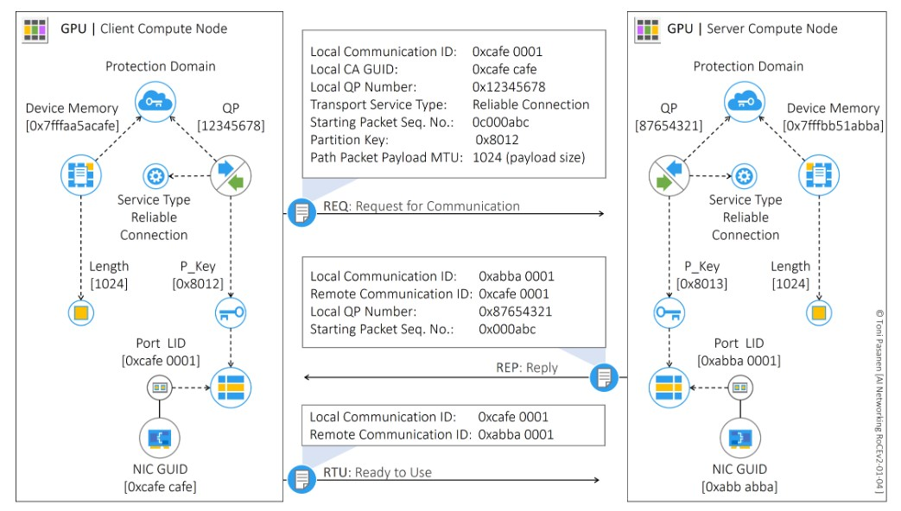
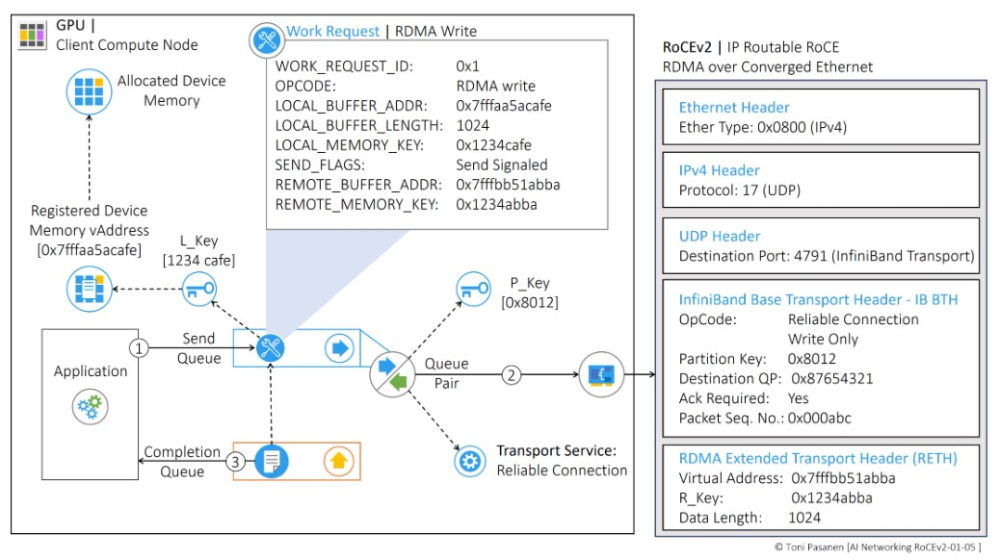
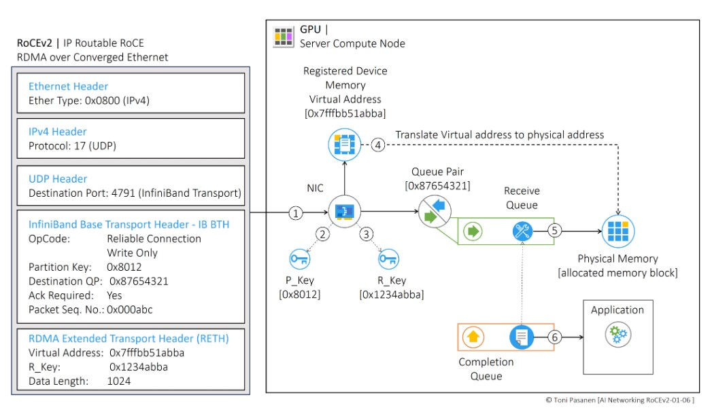

下面将重点介绍示例应用将数据从客户端计算节点 (CCN) 的设备内存写入服务器计算节点 (SCN) 的设备内存时所涉及的过程，共分为四步：1) 内存分配和注册、2) 创建队列对、3) 连接启动、 4) 从 CCN 和 SCN 的角度进行的写入操作。

## 内存分配和注册
首先，我们分配一个保护域 (PD)。你可以将 PD 视为 IP 网络中的租户。它能够为你的对象创建专用的私有环境，类似于传统网络中的虚拟路由和转发 (VRF) 实例，其中“对象”是 IP 地址和路由表。分配 PD 后，我们从物理设备内存中分配一个内存块并进行注册。在内存注册过程中定义内存块的大小并设置其访问权限。在示例中，我们将 CCN 中已注册内存的访问权限设置为本地读取，将 SCN 中的访问权限设置为远程写入。接下来，我们将已注册的设备内存空间与 PD 关联起来。

注意，分配的物理内存可能不是连续的；因此，注册过程会创建一个虚拟的连续内存块。这些过程的结果是，我们会收到一个本地内存访问密钥，即 L_Key。当我们为 RDMA 写入操作注册内存并为其分配远程写入访问权限时，我们会收到一个远程内存密钥，即 R_Key。这就是SCN 的情况。R_Key 通过管理连接发送到 CCN。在此阶段，两个节点都已注册了与 PD 关联的设备内存。此外，还生成了 L_Keys 和 R_Keys。

## 创建队列对
工作队列 (WQ) 是 NIC 和设备内存之间的双向虚拟通信通道。WQ 由两个队列组成：发送队列（用于 RDMA 发送和写入操作）和接收队列（用于接收操作）。队列对 (QP) 由这两个队列组成。完成队列 (CQ) 用于通知应用程序 RDMA 操作的完成状态。每个 QP 都分配有一个服务类型，它定义了连接的服务级别（可靠或不可靠）和类型（连接：点对点或数据报：点对多点）。在示例中，我们使用可靠连接 (RC)。

创建队列对时，我们将其与注册的虚拟内存块关联的同一 PD 绑定。我们还将发送和接收队列绑定到相同或不同的完成队列。接下来，我们设置 QP 的服务类型。在 QP 创建过程中，还要定义发送和接收工作请求的最大数量及其最大消息大小。

要在计算节点之间建立通信通道，CCN 和 SCN 的 NIC 端口必须属于同一分区。NIC 的每个端口都充当 RDMA 域中的端点。每个端口都有一个分区密钥 (P_Key) 表，其中至少有一个 P_Key。创建队列对后，我们从特定端口查询 P_Key，将 QP 状态设置为 INIT（初始化），并设置 P_Key 值。CCN 在连接启动过程中将 P_Key 发送到连接请求中的 SCN。CCN 在每个 RDMA 消息中包含 P_Key，接收节点验证数据报中的 P_Key 是否与目标 QP 的 P_Key 匹配。

你可以将 P_Key 视为队列对的虚拟连接标识符，类似于 VXLAN 标头中的 VXLAN 网络标识符 (VNI) 标识 VXLAN 段的方式。在示例中，CCN 上的 QP 标识为 0x12345678，与其关联的 P_Key 为 0x8012。

## RDMA 连接启动
在此阶段，CCN 上的应用程序通过向 SCN 上的应用程序发送通信请求 (REQ) 消息来启动连接初始化。REQ 消息包括本地通信标识符 (LID) 和通道适配器的全局唯一标识符 (Local CA GUID)。Local CA GUID 标识 NIC，Local Communication ID标识 NIC 上的端口。REQ 消息还携带本地 QP 编号 (0x12345678)、QP 服务类型 (可靠连接)、起始数据包序列号 (PSN: 0x000abc)、P_Key 值 (0x8012) 和有效负载大小 (1024)。

SCN 的 Reply 消息描述了本地和远程通信 ID、QP 编号和 PSN。CCN 使用 Ready to Use (RTU) 消息响应 Reply 消息。在连接初始化过程中，QP 状态从 INIT 转换为 Ready to Send 和 Ready to Receive 状态。连接启动后，CCN 上的应用程序可以启动 RDMA 写入进程。

## 工作请求消息
成功启动连接后，CCN 上的应用程序可以开始 RDMA 写入操作。它创建一个工作请求 (WR)，并将其作为工作请求实体 (WRE) 发布到分配的 QP 的发送队列。WRE 包含以下信息：

- 工作请求标识符：标识 WR，并充当完成队列中的指针，当 WR 已被处理时向应用程序发出信号。
- OpCode：指定操作的类型，例如本例中的 RDMA 写入。
- 本地缓冲区地址和长度：描述数据在本地设备内存中写入 SCN 内存的位置，以及数据的长度。
- 本地内存密钥（L_Key）：用于访问本地内存缓冲区。
- 发送标志：表示应通过完成队列向应用程序发出 WR 成功处理的信号。
- 远程缓冲区地址：指定 SCN 上的目标内存位置。
- 远程密钥（R_Key）：用于访问 SCN 上的远程内存缓冲区。R_Key 通过管理连接从 SCN 接收。
NIC 从发送队列中获取 Work Request，根据 WR 信息构造 Infiniband Base Transport Header（IB BTH），其中包含在连接发起过程中获取的 P_Key 和 Destination QP identifier。由于是“可靠连接”服务类型，因此 AckRequired 值设置为 Yes。

RDMA 写入操作需要 RDMA 扩展传输报头 (RETH)，其中详细说明了目标内存缓冲区、R_Key 和数据长度。IB BTH 和 RETH 报头封装在以太网/IP/UDP 报头中。UDP 报头中的目标端口 4791 表示下一个报头是 IB BTH。

数据被包裹在 Eth/IP/UDP/IB BTH/RETH 报头内并转发至 SCN。

当 SCN 收到 RDMA 写入消息时，它会检查收到的 P_Key 并分配入口端口。此外，它还会验证 R_Key，以确保它与通过管理连接发布到 CCN 的内容相匹配。完成这些验证后，NIC 将虚拟设备内存地址转换为物理内存访问，并将 RDMA 写入信息发送到 QP 的接收队列。最后，一旦 RDMA 写入操作完成，应用程序就会通过完成队列收到作业已完成的通知。

