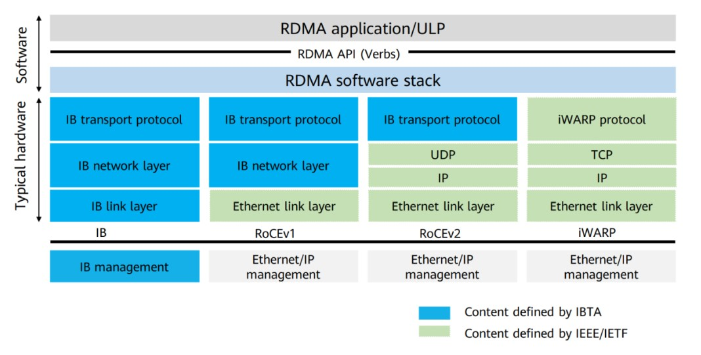
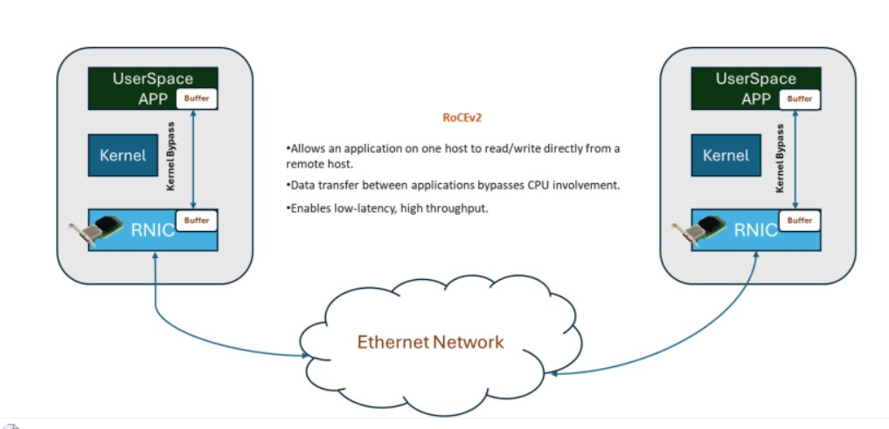
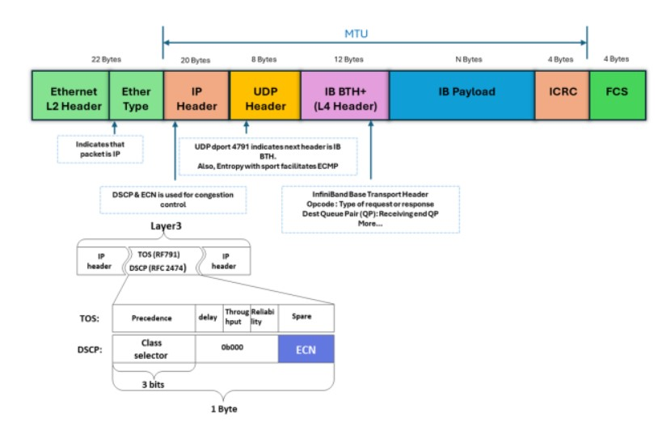
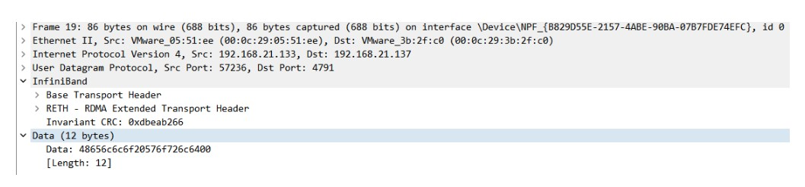

## 技术特点
- 内核 Bypass： RDMA允许数据直接在内存之间传输，而不需要通过操作系统内核。传统的Socket通信在数据传输时需要将数据从用户空间复制到内核空间，然后再从内核空间复制到另一个用户空间。而RDMA通过绕过内核，使数据可以直接在用户空间之间传输，从而减少了数据复制的开销，提高了数据传输效率。
- 零拷贝： RDMA支持零拷贝操作，意味着数据可以直接在应用程序的内存空间中传输，而无需中间的数据拷贝操作。这减少了CPU的负担和数据传输的延迟，提高了系统性能。
- 协议卸载： RDMA技术允许网络适配器卸载协议的处理任务，将网络协议的处理从主机CPU转移到网络适配器上。这样可以减轻主机CPU的负担，提高系统整体性能。
- 低延迟和高吞吐量： RDMA的直接内存访问和零拷贝特性导致了低延迟和高吞吐量。数据可以直接在内存之间传输，而不需要中间的数据复制，从而减少了通信的延迟并提高了数据传输的速率。
- 支持远程直接内存访问： RDMA允许应用程序直接访问远程主机的内存，而无需通过中间服务器进行数据传输。这使得在分布式系统中进行高效的数据共享成为可能，同时减少了通信的开销。

### RoCE协议
RoCE技术支持在以太网上承载IB协议，实现RDMA over Ethernet。RoCE与InfiniBand技术有相同的软件应用层及传输控制层，仅网络层及以太网链路层存在差异。
- RoCE v1协议：基于以太网承载RDMA，只能部署于二层网络，它的报文结构是在原有的IB架构的报文上增加二层以太网的报文头，通过Ethertype 0x8915标识RoCE报文。
- RoCE v2协议：基于UDP/IP协议承载RDMA，可部署于三层网络，它的报文结构是在原有的IB架构的报文上增加UDP头、IP头和二层以太网报文头，通过UDP目的端口号4791标识RoCE报文。RoCE v2支持基于源端口号hash，采用ECMP实现负载分担，提高了网络的利用率。

要利用 RoCEv2，源主机和目标主机上都需要支持 RDMA 的专用 RDMA NIC (RNIC)。 RDMA 卡的物理 (PHY) 速度通常是 50Gbps 起，目前已经提升至高达400Gbps。

#### RoCEv2 数据包格式
为了确保在IP和UDP第3层以太网上实现对RDMA流量的无缝传输，数据包封装至关重要。专用UDP目标端口4791用于表示InfiniBand有效负载，同时针对不同的队列对（QP），使用不同的源端口，可以实现等价多路径（ECMP）负载共享，以优化转发效率。

具体来说：

- RoCEv2在IPv4/UDP或IPv6/UDP协议之上运行，使用以太网链路层的IP和UDP标头替代InfiniBand网络层，实现路由。
- 它默认使用UDP目标端口号4791。
- UDP源端口被用作流标识符，可利用ECMP优化数据包转发。
- RoCEv2流量和拥塞控制利用IP标头中的优先级流量控制（PFC）和显式拥塞通知（ECN）位来管理拥塞，并使用拥塞通知数据包（CNP）帧进行确认。

为了发挥RDMA的真正性能，需要构建无损网络。在以太网交换机上实施RoCEv2需要注意以下关键因素，以确保最佳性能和兼容性：

- 1、MTU（最大传输单元）：RoCEv2需要比传统以太网流量更大的MTU，以容纳额外的RDMA标头。建议将最小MTU设置为9000字节，以避免碎片并确保高效的数据传输。

- 2、QoS（服务质量）：实施QoS机制对于优先考虑RoCEv2流量并确保低延迟通信至关重要。需要配置交换机队列和调度算法，使RDMA流量比其他网络流量具有更高的优先级。差分服务代码点（DSCP）标记可根据优先级对流量进行分类，并根据其在网络中的重要性对RoCEv2流量进行优先级排序，实现更精细的QoS控制。以太网交换机应支持基于DSCP的QoS，以有效管理RoCEv2流量并保持最佳网络性能。

- 3、PFC（优先级流量控制）：PFC对于创建无损以太网至关重要，因为它可以防止数据包丢失并确保RDMA流量的可靠传输。交换机必须支持基于IEEE 802.1Qbb标准的PFC，以实现RoCEv2的无损操作。

- 4、ECN（显式拥塞通知）：ECN在管理拥塞和维持最佳网络性能方面发挥着至关重要的作用，特别是数据中心量化拥塞通知（DCQCN）。交换机必须支持ECN机制，才能对RoCEv2流量进行有效的拥塞控制。

由于RDMA要求承载网络无丢包，否则效率就会急剧下降，所以RoCE技术如果选用以太网进行承载，就需要通过PFC，ECN以及DCQCN等技术对传统以太网络改造，打造无损以太网络，以确保零丢包。

PFC：基于优先级的流量控制。PFC为多种类型的流量提供基于每跳优先级的流量控制。设备在转发报文时，通过在优先级映射表中查找报文的优先级，将报文分配到队列中进行调度和转发。当802.1p优先级报文的发送速率超过接收速率且接收端的数据缓存空间不足时，接收端向发送端发送PFC暂停帧。当发送端收到 PFC 暂停帧时，发送端停止发送具有指定 802.1p 优先级的报文，直到发送端收到 PFC XON 帧或老化定时器超时。配置PFC时，特定类型报文的拥塞不影响其他类型报文的正常转发，

ECN：显式拥塞通知。ECN 定义了基于 IP 层和传输层的流量控制和端到端拥塞通知机制。当设备拥塞时，ECN 会在数据包的 IP 头中标记 ECN 字段。接收端发送拥塞通知包（CNP）通知发送端放慢发送速度。ECN 实现端到端的拥塞管理，减少拥塞的扩散和加剧。
### ROCE测试方法

RDMA测试杂谈 https://www.sdnlab.com/26423.html