# 链路层
## Ethernet Ⅱ以太帧
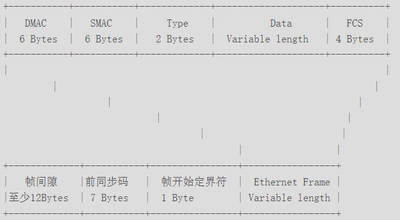
一个ethernet报文的长度是 14+IP报文+4

- 帧间隙 至少12字节

    每个以太帧之间都要有帧间隙（Inter Frame Gap），即每发完一个帧后要等待一段时间才能再发另外一个帧，以便让帧接收者对接收的帧做必要的处理（如调整缓存的指针、更新计数、通知对报文进行处理等等）。在以太网标准中规定最小帧间隙是12个字节，其数据为全1。对于个别的接口，可减少到64(GE)或40比特(10GE)，其他的接口都不应该小于12字节。

- 前同步码 7字节

    以太网标准中规定前导码为10101010 10101010 10101010 10101010 10101010 10101010 10101010（二进制），共7字节。

- 帧开始定界符 1字节

    以太网标准中规定帧开始定界符为10101011（二进制），共1字节。

#### FCS 4字节
帧校验序列FCS（Frame Check Sequence）是为接收者提供判断是否传输错误的一种方法，如果发现错误，丢弃此帧。
FCS只是通用叫法，具体的FCS还可以细分多种校验方法。在以太帧中，FCS通常采用循环冗余码校验CRC（Cyclical Redundancy Check）。

## VLAN帧格式
IEEE 802.1Q标准对以太帧格式进行了修改，在源MAC地址字段和协议类型字段之间加入4字节的802.1Q Tag。802.1Q Tag也称为VLAN Tag，带有VLAN Tag的以太帧称为VLAN帧。
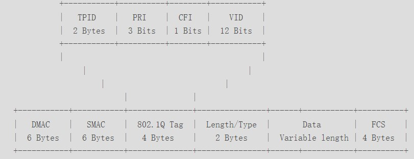

#### TPID字段
根据IEEE 802.1Q标准的定义，取值为0x8100时表示802.1Q Tag（VLAN）帧。如果不支持802.1Q的设备收到这样的帧，会将其丢弃

# MPLS
MPLS(Multiprotocol Label Switching)位于TCP/IP协议栈中的链路层和网络层之间，用于向IP层提供连接服务，同时又从链路层得到服务。MPLS以标签交换替代IP转发。标签是一个短而定长的、只具有本地意义的连接标识符，与ATM的VPI/VCI以及Frame Relay的DLCI类似。标签封装在链路层和网络层之间。MPLS不局限于任何特定的链路层协议，能够使用任意二层介质传输网络分组。
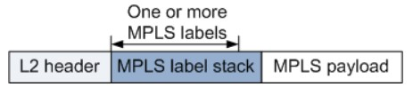

# 网络层
## ARP/RARP报文
ARP（Address Resolution Protocol，地址解析协议）是用来将IP地址解析为MAC地址的协议。RARP（Reverse Address Resolution Protocol，反向地址解析协议）是用来将MAC地址解析为IP地址的协议。
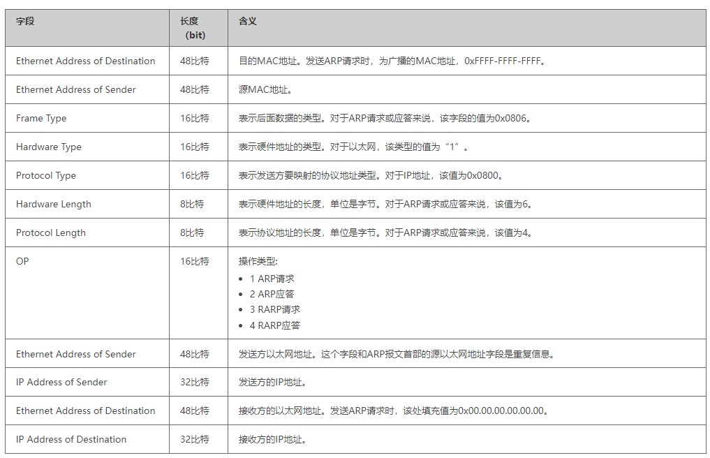

## IP包头
如果不带option字段，则IP包头的最小长度是20字节
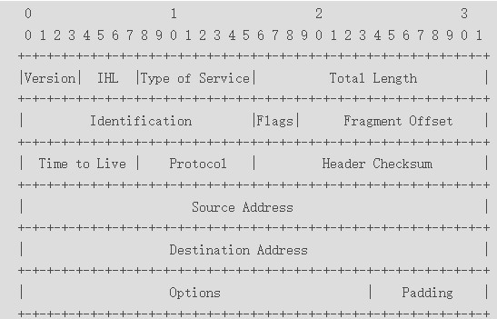
- IHL 4比特
    首部长度，如果不带Option字段，则为20，最长为60，该值限制了记录路由选项。以4字节为一个单位。
- Header Checksum 16比特 
    首部检验和，只检验数据包的首部，不检验数据部分。这里不采用CRC检验码，而采用简单的计算方法。

## IPv6包头
IPv6包头的固定长度是 40字节。与IPv4不同，IPv6的包头结构更简洁和固定，不包括可变长度的选项字段。因此，IPv6的包头长度始终是40字节。
IPv6通过扩展头来处理可选功能，而不是像IPv4那样在包头中直接增加选项字段。因此，IPv6包头的固定长度使其在转发时更高效。
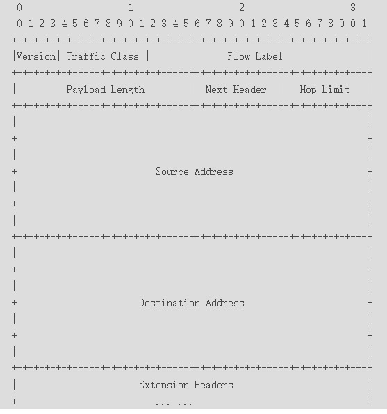
IPv6包头中没有checksum，IPv6报文也不支持分片

## GRE包头
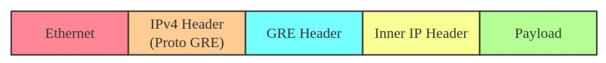
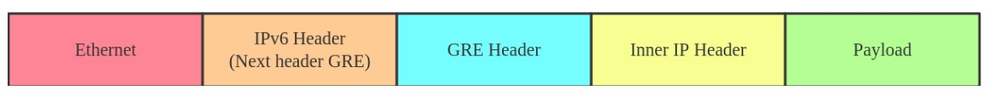

## ICMP包头
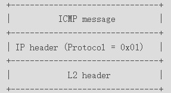

# 传输层
## TCP
TCP包头的长度由数据偏移（Data Offset）字段指定，该字段占4位，表示TCP包头的长度（单位是4字节）。因此，最小的TCP包头长度是20字节
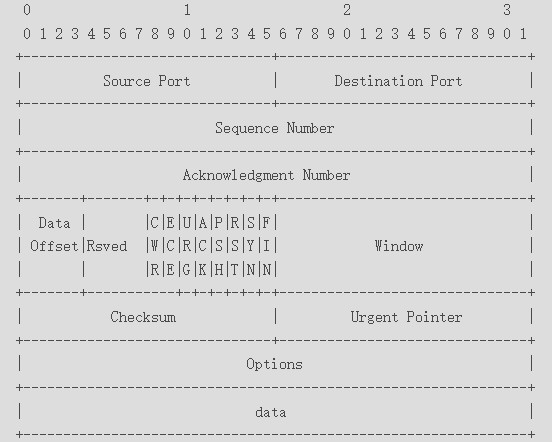
- Sequence Number
    序号字段。TCP链接中传输的数据流中每个字节都编上一个序号。序号字段的值指的是本报文段所发送的数据的第一个字节的序号。
- Acknowledgment Number
    确认号，是期望收到对方的下一个报文段的数据的第1个字节的序号，即上次已成功接收到的数据字节序号加1。只有ACK标识为1，此字段有效。
- Data Offset
    数据偏移，即首部长度，指出TCP报文段的数据起始处距离TCP报文段的起始处有多远，以32比特（4字节）为计算单位。最多有60字节的首部，若无选项字段，正常为20字节。
- SYN
    同步序号标识，用来发起一个连接。SYN=1表示这是一个连接请求或连接接受请求。
- FIN
    发端完成发送任务标识。用来释放一个连接。FIN=1表明此报文段的发送端的数据已经发送完毕，并要求释放连接。
- Window
    窗口：TCP的流量控制，窗口起始于确认序号字段指明的值，这个值是接收端期望接收的字节数。窗口最大为65535字节。
- Checksum
    校验字段，包括TCP首部和TCP数据，是一个强制性的字段，一定是由发端计算和存储，并由收端进行验证。在计算检验和时，要在TCP报文段的前面加上12字节的伪首部。

## UDP
UDP包头长度固定，8个字节，没有option字段
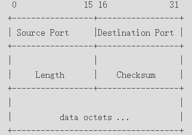
