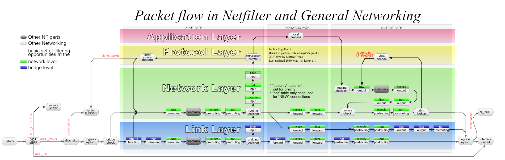
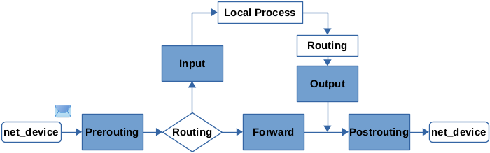
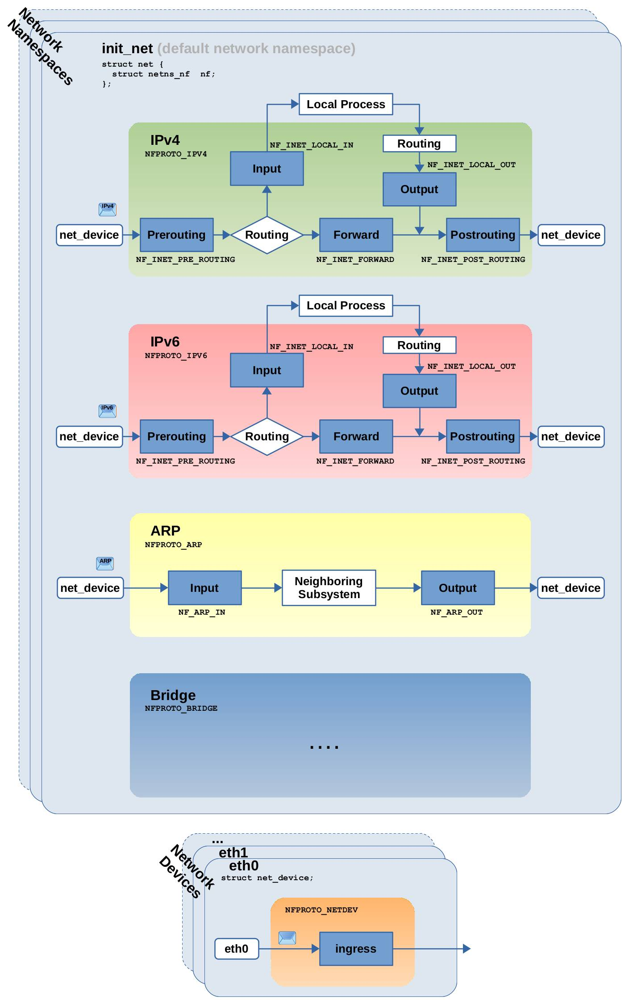
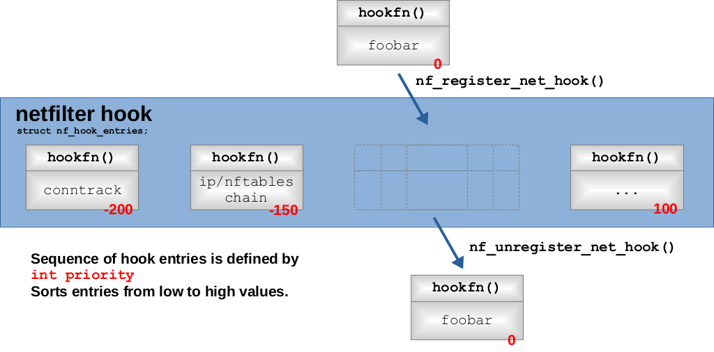
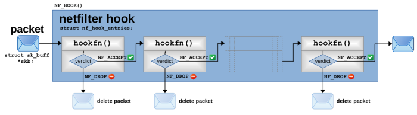
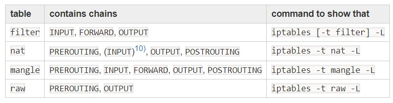
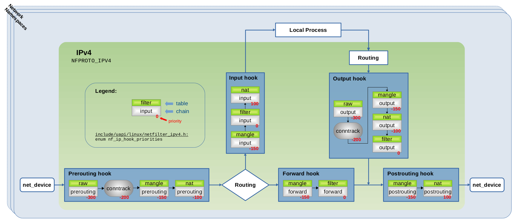
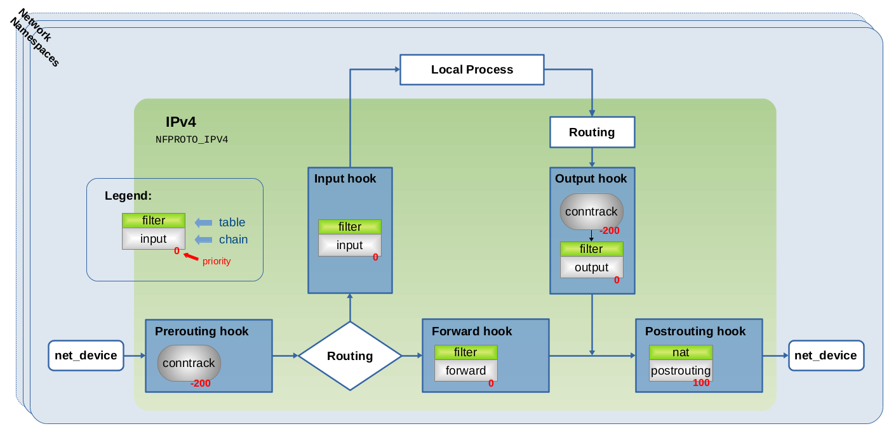

如果您正在使用 iptables 或更新的 nftables，并且仅进行一些简单的 IPv4 数据包过滤，那么您可能会从官方文档和提供示例配置的网站中获取到足够的信息。然而，如果您正在处理稍微复杂一些的事情，比如编写同时关注 IPv4 和 IPv6、使用 IPsec 并进行 NAT 或其他“更有趣”的事情……那么事情就会变得有些棘手。如果您想确保知道自己在做什么，并且正确创建和放置您的表、链和规则以使它们执行正确的操作……那么更详细地了解网络数据包的流动以及 nftables 和底层 Netfilter 框架的内部工作将是有益的。
通过这篇文章，我将尝试解释 Nftables 的概念，如基本链、优先级和地址族，并将它们与通过 Netfilter 钩子的实际网络数据包流量联系起来。
下图旨在可视化 Linux 内核中通过 Netfilter 钩子的网络数据包流动，从而可视化 Iptables 或 Nftables 中的表、链和规则的数据包流动。


### Netfilter

Linux内核中的Netfilter框架是Iptables或较新的Nftables等数据包选择系统所构建的基本构建块。它在Linux内核中提供了一堆钩子，网络数据包在内核中流动时会通过这些钩子。其他内核组件可以向这些钩子注册回调函数，这使它们能够检查数据包并决定是否应丢弃（=删除）数据包或接受（=继续通过内核）数据包。下图是Netfilter数据包流图的简化版本，显示了这些钩子。


网络设备接收到的网络数据包首先经过 Prerouting 钩子。然后进行路由决策，内核确定此数据包是否针对本地进程（例如，系统上监听的服务器的套接字），或者此数据包是否应该被转发（在这种情况下，系统作为路由器工作）。在第一种情况下，数据包然后经过 Input 钩子，然后传递给本地进程。在第二种情况下，数据包经过 Forward 钩子，最后经过 Postrouting 钩子，然后被发送到网络设备上。由本地进程生成的数据包（例如，希望在网络上发送一些内容的客户端或服务器软件）首先经过 Output 钩子，然后也经过 Postrouting 钩子，然后才被发送到网络设备上。

这五个钩子已经在 Linux 内核中存在了很长时间。当然，如果您深入了解细节，现在的情况更加复杂。我试图在下图中展示这一点。图像中的 Courier（比如NF_INET_LOCAL_IN） 字体指示了在 Linux 内核源代码中的宏命名方式。


如您所见，这五个钩子分别独立存在于 IPv4 和 IPv6 协议中（意味着 IPv4 和 IPv6 数据包分别经过各自的钩子）。还有其他钩子供 ARP 数据包或进行桥接时经过（我在这里不详细介绍）。还存在额外的入口钩子，每个网络设备都独立存在。列表还在继续……不能保证完整性）。Nftables 使用其称为地址族（ip、ip6、inet、arp、bridge、netdev）来抽象这些内容，稍后再详细介绍。

#### Network Namespaces
如果您不使用或关心网络命名空间，或者不知道它们是什么，那么您可以忽略本节。只需注意：即使您没有显式地使用网络命名空间（例如通过创建额外的命名空间），仍然存在一个实例，即默认网络命名空间“init_net”，所有网络操作都发生在该命名空间内。
所有提到的钩子在每个网络命名空间内都是独立存在（即被重新创建）。这意味着在 Linux 内核中保存已注册到钩子的回调函数列表的数据结构将针对每个新的网络命名空间重新创建（最初为空）。因此，注册到这些钩子的实体是不同的，并且对每个网络命名空间是个体化的。当然，网络命名空间的实际概念及其影响远远超出了这个范围，但这不是本文的主题。
#### 注册钩子函数
如前所述，钩子的概念是为其他内核组件提供注册回调函数的机会，这些函数将被调用用于每个经过该钩子的网络数据包。Netfilter 提供了一个 API 来实现这一点，Iptables、Nftables 和进一步的系统如Connection Tracking都使用了这个 API。该 API 提供了 nf_register_net_hook() 和 nf_unregister_net_hook() 函数来注册/注销特定钩子的回调函数。下图可视化了这一过程。


多个回调函数可以注册到同一个钩子上。Netfilter 在一个数组中保存这些函数的函数指针（以及一些元数据），每当某个组件注册/注销函数时，该数组会动态增长或缩小。每个 Netfilter 钩子都有自己的数组，实现为内核中的 struct nf_hook_entries 的实例。在互联网上的大多数其他文档以及 Netfilter 开发者社区的讨论中，这些注册的回调函数通常被称为“钩子函数”。因此，从现在开始，我也会称它们为“钩子函数”。

#### 优先级

这个数组中钩子函数的顺序很重要，因为通过钩子的网络数据包将按照这些函数在数组中的顺序依次经过。当注册一个钩子函数时，调用者需要指定一个优先级值（在上图中以红色显示），Netfilter 将使用该值来确定在数组中插入新钩子函数的位置。优先级是一个有符号整数值（int）。Netfilter 将钩子函数按照优先级值从低到高的升序排序。因此，具有较低值（如-200）的钩子函数会排在具有较高值（如100）的钩子函数之前。内核包含了几个枚举类型，定义了一些常见的离散优先级值。这里似乎有点混乱，因为这些枚举类型对于每个协议（即 Nftables 将其称为的每个地址族）都有所不同。下面以 IPv4 协议的枚举类型为例展示了这一点：
```
enum nf_ip_hook_priorities {
	NF_IP_PRI_FIRST = INT_MIN,
	NF_IP_PRI_RAW_BEFORE_DEFRAG = -450,
	NF_IP_PRI_CONNTRACK_DEFRAG = -400,
	NF_IP_PRI_RAW = -300,
	NF_IP_PRI_SELINUX_FIRST = -225,
	NF_IP_PRI_CONNTRACK = -200,
	NF_IP_PRI_MANGLE = -150,
	NF_IP_PRI_NAT_DST = -100,
	NF_IP_PRI_FILTER = 0,
	NF_IP_PRI_SECURITY = 50,
	NF_IP_PRI_NAT_SRC = 100,
	NF_IP_PRI_SELINUX_LAST = 225,
	NF_IP_PRI_CONNTRACK_HELPER = 300,
	NF_IP_PRI_CONNTRACK_CONFIRM = INT_MAX,
	NF_IP_PRI_LAST = INT_MAX,
};
```
#### 硬编码 vs 灵活性
Netfilter 钩子本身被硬编码到 Linux 内核网络堆栈中。如果搜索名为 NF_HOOK() 的函数调用，您将在源代码中找到它们。如果您想知道为什么其他内核组件需要在运行时向这些 Netfilter 钩子注册钩子函数，以及为什么这些钩子函数也没有被硬编码,有以下两个原因：
- 首先，这种在运行时具有灵活性是内核的基本要求之一，因为在内核中许多组件（包括 Nftables、Iptables 和连接跟踪）可能在运行时作为内核模块加载或卸载，并且还使用了诸如网络命名空间之类的进一步抽象的强大概念。
- 性能是一个至关重要的问题。每个网络数据包都需要经过注册到 Netfilter 钩子的所有钩子函数。因此，这些钩子函数应该以经济的方式注册。这可能是 Nftables 中基本链需要由用户显式创建的原因之一，与 Iptables 的预定义链相对应（下面将详细说明）。

#### 钩子遍历与判定
注册到相同 Netfilter 钩子的钩子函数是如何被网络数据包遍历的。对于每个经过此钩子的网络数据包，钩子函数会按照它们在钩子数组中的顺序逐个调用（由优先级值定义的顺序）。

在 Linux 内核中，网络数据包被表示为 struct sk_buff 的实例（通常称为“套接字缓冲区”，简称为“skb”）。这样一个 skb 实例的指针被作为参数传递给所有这些钩子函数，因此每个函数都可以检查数据包。每个钩子函数都需要向 Netfilter 返回一个“判决”作为返回值。对于“判决”，有几个可能的值，但是为了理解这些概念，只有这两个是相关的：NF_ACCEPT 和 NF_DROP。NF_ACCEPT 告诉 Netfilter，钩子函数“接受”了网络数据包。这意味着数据包现在将发往该钩子注册的下一个钩子函数（如果存在）。如果此钩子的所有钩子函数返回 NF_ACCEPT，则数据包最终继续其在内核网络堆栈中的遍历。然而，如果钩子函数返回 NF_DROP，则数据包将被“丢弃”（即删除），不会继续遍历其他钩子函数或网络堆栈的部分。

### Iptables
让我们简要了解一下 Iptables，作为 Nftables 的前身。Iptables 将其规则组织成表和链，而表在很大程度上仅是一种方式（一个容器），用于将具有共同特点的链组合在一起。例如，用于 NAT 的链属于 nat 表。实际的规则驻留在链内。Iptables通过注册自己的钩子函数，将其链注册到 Netfilter 钩子中。这意味着当一个网络数据包经过一个钩子（例如，Prerouting），那么这个数据包将经过注册到该钩子的链，从而经过iptables的规则。
在 使用Iptables 的情况下，所有这些都已经预定义好了。存在一组固定的表，每个表包含一组固定的链。这些链的命名方式与它们注册的 Netfilter 钩子相同。当数据包经过钩子时，链的遍历顺序（其优先级）也已经固定好了。

下图展示了注册到 IPv4 Netfilter 钩子的 iptables 链（绿色的是iptable的表名字）：


### Nftables
一般来说，Nftables 将其规则组织成与 Iptables 相同的表和链。表再次是链的容器，链承载着规则。然而，与 Iptables 不同，Nftables 中不存在预定义的表或链。所有表和链都必须由用户显式创建。用户可以在创建它们时为表和链指定任意名称。Nftables 区分所谓的基本链和常规链。基本链是通过钩子函数（如上所述）向 Netfilter 钩子注册的链，创建链时必须指定该钩子。常规链不向任何钩子注册（常规链不在本文中讨论）。因此，用户不必强制将基本链命名为将要注册的 Netfilter 钩子的名称。这显然提供了更多的自由和灵活性，但也有更多可能造成混淆的潜力。
#### 地址族
与 Iptables 不同，Nftables 没有被分割成几个用户空间工具和相应的内核组件，来处理 Netfilter 提供的不同组的钩子。它通过引入所谓的地址族的概念来解决这个问题。当您创建一个表时，您需要指定它属于哪个地址族。以下地址族存在，并映射到以下 Netfilter 钩子的组：

- ip: 映射到 IPv4 协议钩子 / NFPROTO_IPV4（默认）
- ip6: 映射到 IPv6 协议钩子 / NFPROTO_IPV6
- inet: 映射到 IPv4 和 IPv6 协议钩子
- arp: 映射到 ARP 协议钩子 / NFPROTO_ARP
- bridge: 映射到桥接钩子 / NFPROTO_BRIDGE
- netdev: 映射到入口钩子 / NFPROTO_NETDEV


因此，您在表中创建的所有基本链都将注册到您为该表选择的地址族的指定 Netfilter 钩子上。ip 地址族（IPv4）是默认的地址族。因此，如果您在创建表时没有指定地址族，则此表将属于 ip。

以下示例创建一个名为 foo 的新表，属于地址族 ip，然后在表 foo 中创建一个新的基本链 bar，在 ip 地址族的 input Netfilter 钩子上注册它，并指定优先级为 0（我在此显式指定 ip 地址族只是为了强调正在发生的事情；它可以省略。）
```
nft create table ip foo
nft create chain ip foo bar {type filter hook input priority 0\;}
```

inet 地址族是特殊的。当您创建一个属于该族的表，然后在该表中创建一个基本链时，这个基本链将注册到两个 Netfilter 钩子上：IPv4 和 IPv6 的等效钩子。这意味着 IPv4 和 IPv6 数据包都将遍历该链的规则。以下示例创建一个名为 foo 的表和一个名为 bar 的基本链，地址族为 inet。基本链 bar 将注册到 IPv4 的 Netfilter input 钩子和 IPv6 的 Netfilter input钩子上。
```
nft create table inet foo
nft create chain inet foo bar {type filter hook input priority 0\;}
```
#### 优先级
在上面的示例中，您已经看到，创建基本链时 Nftables 要求您指定优先级值。这与我在上面详细描述的 Netfilter 中的优先级是完全相同的。您可以指定整数值，但是较新版本的 Nftables 还为几个离散优先级值定义了占位符名称，类似于 Netfilter 中提到的枚举。

在创建基本链时，您可以例如指定优先级过滤器，将其转换为优先级 0。以下示例创建了一个名为 myfilter 的表，地址族为 ip（IPv4）。然后创建了两个名为 foo 和 bar 的基本链，分别将它们注册到 Netfilter IPv4 钩子input上，但每个具有不同的优先级。经过 Netfilter 钩子input的 IPv4 网络数据包将首先经过 foo 链，然后经过 bar 链。
```
nft create table ip myfilter
nft create chain ip myfilter foo {type filter hook input priority 0\;}
nft create chain ip myfilter bar {type filter hook input priority 50\;}

# alternatively you could create the same chains using named priority values:
nft create chain ip myfilter foo {type filter hook input priority filter\;}
nft create chain ip myfilter bar {type filter hook input priority security\;}
```
当您注册两个具有相同优先级的相同钩子的基本链时，实际上发生了什么？Netfilter 的源代码回答了这个问题。实际上允许注册具有相同优先级值的相同钩子的钩子函数。在以下示例中，首先为 chain1 调用函数 nf_register_net_hook()，然后为 chain2 调用。
```
nft create chain ip table1 chain1 {type filter hook input priority 0\;}
nft create chain ip table1 chain2 {type filter hook input priority 0\;}
```
内核代码将 chain2 放置在此钩子的钩子函数数组中的 chain1 之前（在其前面）。结果，网络数据包在遍历 chain1 之前先遍历 chain2。这意味着在这里，您注册这两个链的命令的顺序变得相关！

#### Example: NAT 边缘路由器

图中的示例演示了一个边缘路由器，执行一些简单的 IPv4 数据包过滤和 SNAT（伪装）。我在这里只是给出了一个最简化的例子。你甚至可以再次删除output链，因为我没有给它添加任何规则。在实际情况下，您肯定会添加一组更复杂的规则。


```
nft create table ip nat
nft create chain ip nat postrouting {type nat hook postrouting priority srcnat\;}
nft add rule ip nat postrouting oif eth1 masquerade

nft create table ip filter
nft create chain ip filter input {type filter hook input priority filter\;}
nft create chain ip filter forward {type filter hook forward priority filter\;}
nft create chain ip filter output {type filter hook output priority filter\;}
nft add rule ip filter forward iif eth1 oif eth0 ct state new,invalid drop
nft add rule ip filter input iif eth1 ip protocol != icmp ct state new,invalid drop
```



