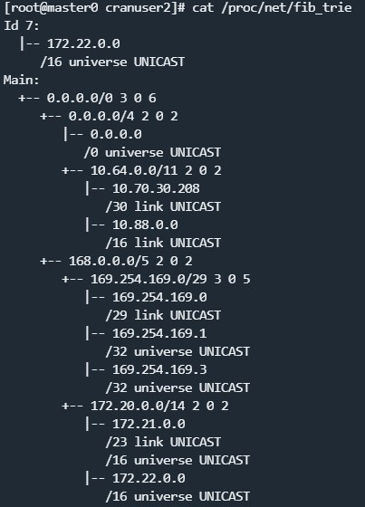

### Linux内核中的路由决策：查找和数据包流程

在这个文章中，我想谈谈Linux内核中IPv4路由查找,以及它产生的路由决策如何确定网络数据包通过堆栈的路径。路由决策的数据结构被用于堆栈的许多部分。Linux内核实现了许多优化和高级路由功能，当阅读源代码的这些部分时，很容易让你“看不到森林只见树木”。这个文章系列试图减轻这种情况。

#### 概述
路由表的查找是内核中处理IP数据包的网络层的一部分。根据数据包的目标IP地址，查找尝试找到最佳匹配的路由条目，从而确定如何处理该数据包。下面是表示数据包通过内核的简化块图：


net_device收到的数据包都要经历“路由查找”过程，一旦识别为IP数据包，这个数据包被送到网络层，并经过Netfilter预处理钩子Prerouting执行路由查找。Prerouting将决定这些数据包是要交给传输层以便被本地套接字接收，还是要被转发然后再次发送到网络上。“路由查找”也用于本地生成的来自传输层的数据包，以确定是否有路由使得这些数据包能够发送到网络上。对于转发以及本地发出的数据包，“路由查找”确定发送网络接口和下一跳网关IP地址（如果存在）。那么，“路由查找”所做出的路由决策是如何实际应用到网络数据包上的呢？嗯，它被附加到数据包上。更精确地说，它附加到表示数据包的套接字缓冲区（socket buffer）（skb）上。
如下图所示，由“路由查找”产生的路由决策对象被分配或从缓存中取出，然后附加到网络数据包（skb）。这个对象包含必要的数据：如输出接口和下一跳网关IP地址。它还包含函数指针，这些函数指针指向了数据包通过内核网络堆栈剩余部分的路径。本文的重点是这个附加的“路由决策”。它通常也被称为“目的地缓存”。


当然，Linux内核的路由子系统经过了大量优化，既包括为了实现高数据包吞吐量而进行的速度优化，也包括保持内存消耗在经济水平的优化。此外，它提供了诸如基于策略的路由、虚拟路由、多路径路由、复杂的缓存特性、对IPv4和IPv6的支持、对多播数据包的支持、接收路径过滤等高级路由功能。

#### 路由查找
路由查找指的是在网络数据包到达网络层时，内核需要根据目标IP地址来决定如何处理该数据包的过程。这通常涉及查找路由表以确定应该将数据包转发到哪个接口或目的地。路由查找是网络协议栈中非常重要的一部分，它确保数据包被正确地转发到目标地址，从而实现网络通信。

路由查找引入了多层复杂性，其函数调用堆栈实际上相当深。我尝试在下面图中说明这个调用堆栈的一些函数。请注意，这里显示的函数远不是全部。我只选择了我认为最相关的函数。在IPv4数据包的接收路径中，如下图左侧所示，路由查找是在函数ip_rcv_finish_core()中完成的。这个函数调用了ip_route_input_noref()，这是一个中间函数，在图3中没有显示。在调用堆栈的更深处，调用了ip_route_input_slow()，它在实际查找之前和之后执行了几项检查，查找是在函数fib_lookup()中完成的，并且还负责创建、缓存和将结果的路由决策附加到网络数据包。
下图右侧是已建立的TCP连接发包的路由查找过程，是在函数__ip_queue_xmit()中完成的。这个函数调用了ip_route_output_ports()，这是一个中间函数，在图3中没有显示。在调用堆栈的更深处，调用了函数ip_route_output_key_hash_rcu()，它在实际查找之前和之后执行了几项检查，查找是在函数fib_lookup()中完成的，并且还负责创建和缓存结果的路由决策。然而，在这种情况下，将路由决策附加到网络数据包并不是在这里完成的，而是在外部函数__ip_queue_xmit()中完成的。如您所见，接收路径和本地输出路径都共享了函数fib_lookup()。这个函数负责策略路由。最后……在调用堆栈的更深处，调用了函数fib_table_lookup()，它包含了路由查找算法


#### fib_table_lookup()

函数fib_table_lookup()执行实际的路由表查找，更准确地说是对单个路由表的查找。由于系统通常具有多个路由表，因此调用这个函数的代码需要指定要查询哪个路由表。在最常见的情况下，这当然是主路由表，这是在输入命令ip route而不带其他参数时显示的路由表。函数fib_table_lookup()需要提供一个数据结构flowi4的实例。这个实例表示您想要传递给路由子系统的“问题”或“请求”。该结构包含几个成员变量。然而，在实践中对函数fib_table_lookup()来说，唯一重要的成员是成员daddr，它保存要进行查找的IP地址。如果查找找到匹配项，那么函数将输出一个数据结构fib_result的实例，正如其名称所暗示的，它表示查找结果。如果找不到匹配项，则会返回一个错误代码。这可能发生在以下情况下：没有路由条目匹配，并且在该路由表中没有指定默认路由。

上图展示了如何查找路由表，您可以将路由表视为键值对列表。键是网络前缀。换句话说，它们是IP地址+子网掩码（比如图中的10.0.0.0和24）。值是路由条目，其中包含输出接口、下一跳网关地址（via后面的地址）等数据。
查找的原理是将表中前缀的网络部分与flowi4成员daddr的相应位进行按位比较，以找到最长匹配的前缀。上图显示了对IP地址192.168.0.5的示例查找。您可以看到前缀192.168.0.0/24匹配。前缀192.168.0.0/16和默认路由0.0.0.0/0也都匹配，但/24是这三个候选项中最长的匹配，因此选中了192.168.0.0/24这条路由（这是一条接口路由）。选中路由后，会根据匹配的路由条目的数据来初始化fib_result实例，并传递给调用函数。
当然，您可能可以想象，这种查找不会简单地遍历路由表的所有前缀，为每个前缀执行按位比较操作。那样肯定效率太低了。毕竟，Linux不仅用于小型嵌入式系统、个人计算机和边缘路由器。它也用于互联网主干中的核心路由器。在后一种情况下，路由表可能有数十万条目。因此，需要一种算法，它能够与这些数字相适应，并且即使在庞大的路由表中也能提供高效的查找。自内核2.6.39以来，用于IPv4的最长匹配前缀查找算法是所谓的FIB trie算法，也称为LC-trie。文件/proc/net/fib_trie可视化了系统上路由表的trie结构，文件/proc/net/fib_triestat显示了一些统计信息和计数器。


#### fib_lookup()

该函数表示调用堆栈上一层更高的抽象层。如上图所见，fib_lookup()的输入是一个flowi4的实例，这个实例的指针会传送给fib_table_lookup()，并返回一个fib_result的实例。
fib_lookup()函数有两个实现：fib_lookup()_1和fib_lookup()_2。内核编译参数IP_MULTIPLE_TABLES决定了使用哪个实现。
- 如果IP_MULTIPLE_TABLES设置为n，则系统上只存在一个名为main的路由表，并且使用函数fib_lookup()_1，它不会做太多事情，只是简单地为该表调用fib_table_lookup()。
- 如果IP_MULTIPLE_TABLES设置为y，这是大多数现代Linux发行版中的常见设置，则系统中存在多个路由表。默认情况下，内核在此处创建了三个表，命名为local、main和default。在这里使用函数fib_lookup()_2，它实现了基于策略的路由(Policy-based routing)（PBR）。
  - 所谓的路由策略数据库（RPDB），它是一组在实际路由查找之前要评估的规则。这些规则指定了在哪种情况下要查询哪个（些）路由表。通过这种方式，在进行路由查找时可以考虑更多的数据包特性，而不仅仅是目标IP地址。这些特性可能包括源IP地址、skb->mark、TCP/UDP源/目的端口等等。这就是为什么flowi4有几个成员变量的原因。尽管底层函数fib_table_lookup()主要关心成员daddr，但函数fib_lookup()中的PBR实现根据规则集使用其他成员。
  - 一个规则可以指定对具有特定源IP地址的数据包查询不同的路由表。您可以使用命令ip rule来列出/添加/删除RPDB中的规则(最后一条rule表示从20.30.3.0/24发出的包，需要优先查找路由表300)：
    ```
        # PRIORITY:  SELECTOR               ACTION
        0         :  from all               lookup local
        32766     :  from all               lookup main
        32767     :  from all               lookup default
        200       :  from 20.30.3.0/24      lookup 300
    ```
    每个规则由三个部分组成：PRIORITY、SELECTOR和ACTION。整数PRIORITY指定了在查找过程中评估规则的顺序。SELECTOR指定了规则的ACTION应该对哪些数据包执行。在上面显示的规则中，"from all" 表示该规则的ACTION应该对包含任意可能的源IP地址的数据包执行（对所有数据包执行）。最后一条规则指定其ACTION仅对源IP地址为20.30.3.0/24的网络数据包执行。lookup local表示应查询名为local的路由表。总之，这组规则意味着对包含任意可能的源IP地址的数据包应该查询三个命名为local、main和default的路由表，然后fib_lookup()所做的就是根据PRIORITY简单地遍历这三个表，并为每个表调用fib_table_lookup()；存在匹配的路由条目，那么查找在此处停止，并使用此匹配作为最终结果，这意味着在这种情况下可能剩余的表不会被查询。
    请记住，具有前缀0.0.0.0/0（默认路由）的路由条目将表示“捕获所有”的匹配，并且在这种设置中，它因此将阻止任何剩余的路由表被查询。那么，表local、main和default有什么目的呢？表local是首先要查询的表。它的所有路由条目都是由内核自动创建的，并且有意地永远不会存在“捕获所有”的默认路由，因此如果在local中找不到匹配项，仍将查询接下来的表main。正如上面提到的，路由查找除其他外，还用于确定哪些网络数据包是用于在本系统上进行本地传递的。假设您将地址192.168.2.100/24分配给本地网络接口eth0。然后，内核不仅分配此地址，还会向表local添加路由条目：
    ```
    broadcast 192.168.2.0   dev eth0 proto kernel scope link src 192.168.2.100 
    local     192.168.2.100 dev eth0 proto kernel scope host src 192.168.2.100 
    broadcast 192.168.2.255 dev eth0 proto kernel scope link src 192.168.2.100
    ```
    第一列指定了路由条目的类型，可以是local或者broadcast，用于添加到表local中的条目。这是路由条目最重要的字段，因为它指定了匹配数据包的操作。Type=local表示该数据包用于本地传递。Type=broadcast表示具有指定广播目标地址的数据包的情况。字段proto指定了创建路由条目的实体。因此，proto kernel表示这些条目是由内核自动创建的。
    第二个要查询的表是main。这是“正常”的路由表，如果您没有显式指定其他位置，那么您使用命令ip route创建的所有路由条目都将存储在这里。当您将IP地址192.168.2.100/24分配给eth0时，内核还会在这里自动创建一个条目：
    ```
    unicast 192.168.2.0/24 dev eth0 proto kernel scope link src 192.168.2.100
    ```
    在这里，Type=unicast表示匹配的数据包将作为普通的单播数据包进行转发，并通过eth0发送出去，下一跳位于eth0的本地广播域（scope link），并且它是终点而不是下一跳网关。
    第三个要查询的表是default。通常，这个表是空的，似乎它只是出于历史原因仍然存在。
    内核本身不关心也不知道路由表的名称。它用一个u32类型的整数tb_id来标识每个路由表。用于标识默认表local（255）、main（254）和default（253）的整数值是硬编码的。iproute2命令如ip rule和ip route既可以使用名称也可以使用整数。文件/etc/iproute2/rt_tables用作名称和整数之间的映射：
    
#### 逆向路径过滤（RPF）
该功能在RFC3704中指定，并且也被称为反向路径转发或路由验证。它旨在作为针对潜在IP地址欺骗的对策，这种欺骗经常在DDoS攻击的范围内进行。它不能完全防止欺骗，但可以限制它。RPF以fib_validate_source()函数的形式实现，该函数在数据包接收路径上的fib_lookup()之后不久被调用；它将为网络数据包的源IP地址执行另一次路由查找。其基本思想是检查是否存在一个潜在的回复数据包的路由，以及该路由是否实际上会通过接收到原始数据包的网络接口发送出去。如果不是，则会丢弃该数据包。

如上图所示，r1路由器从eth1口收到发往192.168.0.1的数据包，在执行完fib_lookup()后，需要对数据包的源地址10.0.0.2执行fib_validate_source()，来确定发往10.0.0.2的数据包是否从eth1口发出，如果不是，则会丢弃该数据包。
RPF的sysctl开关是net.ipv4.conf.all.rp_filter，请注意，IPv6并没有这个开关。


