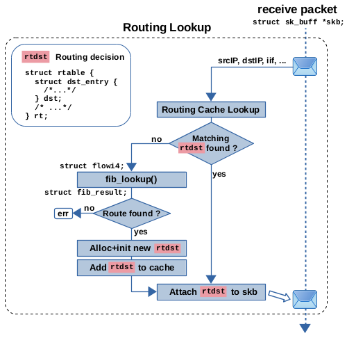

### Linux内核中的路由决策：查找和数据包流程

在这个文章中，我想谈谈Linux内核中IPv4路由查找,以及它产生的路由决策如何确定网络数据包通过堆栈的路径。路由决策的数据结构被用于堆栈的许多部分。Linux内核实现了许多优化和高级路由功能，当阅读源代码的这些部分时，很容易让你“看不到森林只见树木”。这个文章系列试图减轻这种情况。

#### 概述
路由表的查找是内核中处理IP数据包的网络层的一部分。根据数据包的目标IP地址，查找尝试找到最佳匹配的路由条目，从而确定如何处理该数据包。下面是表示数据包通过内核的简化块图：


net_device收到的数据包都要经历“路由查找”过程，一旦识别为IP数据包，这个数据包被送到网络层，并经过Netfilter预处理钩子Prerouting执行路由查找。Prerouting将决定这些数据包是要交给传输层以便被本地套接字接收，还是要被转发然后再次发送到网络上。“路由查找”也用于本地生成的来自传输层的数据包，以确定是否有路由使得这些数据包能够发送到网络上。对于转发以及本地发出的数据包，“路由查找”确定发送网络接口和下一跳网关IP地址（如果存在）。那么，“路由查找”所做出的路由决策是如何实际应用到网络数据包上的呢？嗯，它被附加到数据包上。更精确地说，它附加到表示数据包的套接字缓冲区（socket buffer）（skb）上。
如下图所示，由“路由查找”产生的路由决策对象被分配或从缓存中取出，然后附加到网络数据包（skb）。这个对象包含必要的数据：如输出接口和下一跳网关IP地址。它还包含函数指针，这些函数指针指向了数据包通过内核网络堆栈剩余部分的路径。本文的重点是这个附加的“路由决策”。它通常也被称为“目的地缓存”。


当然，Linux内核的路由子系统经过了大量优化，既包括为了实现高数据包吞吐量而进行的速度优化，也包括保持内存消耗在经济水平的优化。此外，它提供了诸如基于策略的路由、虚拟路由、多路径路由、复杂的缓存特性、对IPv4和IPv6的支持、对多播数据包的支持、接收路径过滤等高级路由功能。

#### 路由查找
路由查找指的是在网络数据包到达网络层时，内核需要根据目标IP地址来决定如何处理该数据包的过程。这通常涉及查找路由表以确定应该将数据包转发到哪个接口或目的地。路由查找是网络协议栈中非常重要的一部分，它确保数据包被正确地转发到目标地址，从而实现网络通信。

路由查找引入了多层复杂性，其函数调用堆栈实际上相当深。我尝试在下面图中说明这个调用堆栈的一些函数。请注意，这里显示的函数远不是全部。我只选择了我认为最相关的函数。在IPv4数据包的接收路径中，如下图左侧所示，路由查找是在函数ip_rcv_finish_core()中完成的。这个函数调用了ip_route_input_noref()，这是一个中间函数，在图3中没有显示。在调用堆栈的更深处，调用了ip_route_input_slow()，它在实际查找之前和之后执行了几项检查，查找是在函数fib_lookup()中完成的，并且还负责创建、缓存和将结果的路由决策附加到网络数据包。
下图右侧是已建立的TCP连接发包的路由查找过程，是在函数__ip_queue_xmit()中完成的。这个函数调用了ip_route_output_ports()，这是一个中间函数，在图3中没有显示。在调用堆栈的更深处，调用了函数ip_route_output_key_hash_rcu()，它在实际查找之前和之后执行了几项检查，查找是在函数fib_lookup()中完成的，并且还负责创建和缓存结果的路由决策。然而，在这种情况下，将路由决策附加到网络数据包并不是在这里完成的，而是在外部函数__ip_queue_xmit()中完成的。如您所见，接收路径和本地输出路径都共享了函数fib_lookup()。这个函数负责策略路由。最后……在调用堆栈的更深处，调用了函数fib_table_lookup()，它包含了路由查找算法


#### fib_table_lookup()

函数fib_table_lookup()执行实际的路由表查找，更准确地说是对单个路由表的查找。由于系统通常具有多个路由表，因此调用这个函数的代码需要指定要查询哪个路由表。在最常见的情况下，这当然是主路由表，这是在输入命令ip route而不带其他参数时显示的路由表。函数fib_table_lookup()需要提供一个数据结构flowi4的实例。这个实例表示您想要传递给路由子系统的“问题”或“请求”。该结构包含几个成员变量。然而，在实践中对函数fib_table_lookup()来说，唯一重要的成员是成员daddr，它保存要进行查找的IP地址。如果查找找到匹配项，那么函数将输出一个数据结构fib_result的实例，正如其名称所暗示的，它表示查找结果。如果找不到匹配项，则会返回一个错误代码。这可能发生在以下情况下：没有路由条目匹配，并且在该路由表中没有指定默认路由。

上图展示了如何查找路由表，您可以将路由表视为键值对列表。键是网络前缀。换句话说，它们是IP地址+子网掩码（比如图中的10.0.0.0和24）。值是路由条目，其中包含输出接口、下一跳网关地址（via后面的地址）等数据。
查找的原理是将表中前缀的网络部分与flowi4成员daddr的相应位进行按位比较，以找到最长匹配的前缀。上图显示了对IP地址192.168.0.5的示例查找。您可以看到前缀192.168.0.0/24匹配。前缀192.168.0.0/16和默认路由0.0.0.0/0也都匹配，但/24是这三个候选项中最长的匹配，因此选中了192.168.0.0/24这条路由（这是一条接口路由）。选中路由后，会根据匹配的路由条目的数据来初始化fib_result实例，并传递给调用函数。
当然，您可能可以想象，这种查找不会简单地遍历路由表的所有前缀，为每个前缀执行按位比较操作。那样肯定效率太低了。毕竟，Linux不仅用于小型嵌入式系统、个人计算机和边缘路由器。它也用于互联网主干中的核心路由器。在后一种情况下，路由表可能有数十万条目。因此，需要一种算法，它能够与这些数字相适应，并且即使在庞大的路由表中也能提供高效的查找。自内核2.6.39以来，用于IPv4的最长匹配前缀查找算法是所谓的FIB trie算法，也称为LC-trie。文件/proc/net/fib_trie可视化了系统上路由表的trie结构，文件/proc/net/fib_triestat显示了一些统计信息和计数器。


#### fib_lookup()

该函数表示调用堆栈上一层更高的抽象层。如上图所见，fib_lookup()的输入是一个flowi4的实例，这个实例的指针会传送给fib_table_lookup()，并返回一个fib_result的实例。
fib_lookup()函数有两个实现：fib_lookup()_1和fib_lookup()_2。内核编译参数IP_MULTIPLE_TABLES决定了使用哪个实现。
- 如果IP_MULTIPLE_TABLES设置为n，则系统上只存在一个名为main的路由表，并且使用函数fib_lookup()_1，它不会做太多事情，只是简单地为该表调用fib_table_lookup()。
- 如果IP_MULTIPLE_TABLES设置为y，这是大多数现代Linux发行版中的常见设置，则系统中存在多个路由表。默认情况下，内核在此处创建了三个表，命名为local、main和default。在这里使用函数fib_lookup()_2，它实现了基于策略的路由(Policy-based routing)（PBR）。
  - 所谓的路由策略数据库（RPDB），它是一组在实际路由查找之前要评估的规则。这些规则指定了在哪种情况下要查询哪个（些）路由表。通过这种方式，在进行路由查找时可以考虑更多的数据包特性，而不仅仅是目标IP地址。这些特性可能包括源IP地址、skb->mark、TCP/UDP源/目的端口等等。这就是为什么flowi4有几个成员变量的原因。尽管底层函数fib_table_lookup()主要关心成员daddr，但函数fib_lookup()中的PBR实现根据规则集使用其他成员。
  - 一个规则可以指定对具有特定源IP地址的数据包查询不同的路由表。您可以使用命令ip rule来列出/添加/删除RPDB中的规则(最后一条rule表示从20.30.3.0/24发出的包，需要优先查找路由表300)：
    ```
        # PRIORITY:  SELECTOR               ACTION
        0         :  from all               lookup local
        32766     :  from all               lookup main
        32767     :  from all               lookup default
        200       :  from 20.30.3.0/24      lookup 300
    ```
    每个规则由三个部分组成：PRIORITY、SELECTOR和ACTION。整数PRIORITY指定了在查找过程中评估规则的顺序。SELECTOR指定了规则的ACTION应该对哪些数据包执行。在上面显示的规则中，"from all" 表示该规则的ACTION应该对包含任意可能的源IP地址的数据包执行（对所有数据包执行）。最后一条规则指定其ACTION仅对源IP地址为20.30.3.0/24的网络数据包执行。lookup local表示应查询名为local的路由表。总之，这组规则意味着对包含任意可能的源IP地址的数据包应该查询三个命名为local、main和default的路由表，然后fib_lookup()所做的就是根据PRIORITY简单地遍历这三个表，并为每个表调用fib_table_lookup()；存在匹配的路由条目，那么查找在此处停止，并使用此匹配作为最终结果，这意味着在这种情况下可能剩余的表不会被查询。
    请记住，具有前缀0.0.0.0/0（默认路由）的路由条目将表示“捕获所有”的匹配，并且在这种设置中，它因此将阻止任何剩余的路由表被查询。那么，表local、main和default有什么目的呢？表local是首先要查询的表。它的所有路由条目都是由内核自动创建的，并且有意地永远不会存在“捕获所有”的默认路由，因此如果在local中找不到匹配项，仍将查询接下来的表main。正如上面提到的，路由查找除其他外，还用于确定哪些网络数据包是用于在本系统上进行本地传递的。假设您将地址192.168.2.100/24分配给本地网络接口eth0。然后，内核不仅分配此地址，还会向表local添加路由条目：
    ```
    broadcast 192.168.2.0   dev eth0 proto kernel scope link src 192.168.2.100 
    local     192.168.2.100 dev eth0 proto kernel scope host src 192.168.2.100 
    broadcast 192.168.2.255 dev eth0 proto kernel scope link src 192.168.2.100
    ```
    第一列指定了路由条目的类型，可以是local或者broadcast，用于添加到表local中的条目。这是路由条目最重要的字段，因为它指定了匹配数据包的操作。Type=local表示该数据包用于本地传递。Type=broadcast表示具有指定广播目标地址的数据包的情况。字段proto指定了创建路由条目的实体。因此，proto kernel表示这些条目是由内核自动创建的。
    第二个要查询的表是main。这是“正常”的路由表，如果您没有显式指定其他位置，那么您使用命令ip route创建的所有路由条目都将存储在这里。当您将IP地址192.168.2.100/24分配给eth0时，内核还会在这里自动创建一个条目：
    ```
    unicast 192.168.2.0/24 dev eth0 proto kernel scope link src 192.168.2.100
    ```
    在这里，Type=unicast表示匹配的数据包将作为普通的单播数据包进行转发，并通过eth0发送出去，下一跳位于eth0的本地广播域（scope link），并且它是终点而不是下一跳网关。
    第三个要查询的表是default。通常，这个表是空的，似乎它只是出于历史原因仍然存在。
    内核本身不关心也不知道路由表的名称。它用一个u32类型的整数tb_id来标识每个路由表。用于标识默认表local（255）、main（254）和default（253）的整数值是硬编码的。iproute2命令如ip rule和ip route既可以使用名称也可以使用整数。文件/etc/iproute2/rt_tables用作名称和整数之间的映射：
    
#### 逆向路径过滤（RPF）
该功能在RFC3704中指定，并且也被称为反向路径转发或路由验证。它旨在作为针对潜在IP地址欺骗的对策，这种欺骗经常在DDoS攻击的范围内进行。它不能完全防止欺骗，但可以限制它。RPF以fib_validate_source()函数的形式实现，该函数在数据包接收路径上的fib_lookup()之后不久被调用；它将为网络数据包的源IP地址执行另一次路由查找。其基本思想是检查是否存在一个潜在的回复数据包的路由，以及该路由是否实际上会通过接收到原始数据包的网络接口发送出去。如果不是，则会丢弃该数据包。

如上图所示，r1路由器从eth1口收到发往192.168.0.1的数据包，在执行完fib_lookup()后，需要对数据包的源地址10.0.0.2执行fib_validate_source()，来确定发往10.0.0.2的数据包是否从eth1口发出，如果不是，则会丢弃该数据包。
RPF的sysctl开关是net.ipv4.conf.all.rp_filter，请注意，IPv6并没有这个开关。

#### 路由决策对象(The routing decision object)
路由决策对象由两个结构体组成，外部结构体为rtable，内部结构体为dst_entry；参见下图。路由决策对象在函数rt_dst_alloc()中被分配和部分初始化。在此函数调用之后进行进一步的成员初始化。另外，这个对象也可以从路由缓存中获取。缓存是一个复杂的话题（后面会介绍）。将这个对象附加到网络数据包（skb）上可以通过函数skb_dst_set()或skb_dst_set_noref()来完成。网络数据包提供成员unsigned long _skb_refdst作为指向路由决策对象的指针。


##### struct rtable
最相关的成员变量有：
- struct dst_entry dst;
    第一个成员变量，因此其内存地址与包含它的struct rtable实例的地址相同，内核代码提供了两个方便的函数skb_rtable(skb)和skb_dst(skb)，它们返回正确转换的指针，分别指向附加到给定skb的这两个结构体之一；
- __u16 rt_type;
    该成员包含导致创建此路由决策对象的匹配路由条目的类型。路由条目的类型确定如何处理网络数据包。所有可能的值都在这个未命名的枚举中定义。
    可以使用命令ip -d route（-d表示“详细信息”）来列出主表的路由条目，类型将显示在输出的每一行的第一列中。
    以下表列出了这些值及其含义。
    | 类型 | 值 | 路由类型 | |
    | ------- | ------- | ------- | ------- |
    | RTN_UNICAST|1|unicast|（路由条目的默认类型）数据包应被转发给网关或接口|
    |RTN_LOCAL|2|local|数据包送到本地应用层处理|
    |RTN_BROADCAST|3|broadcast|数据包将会通过广播地址发送|
    |RTN_MULTICAST|5|multicast|数据包将会通过多播地址发送|
    |RTN_UNREACHABLE|7|unreachable|数据包被丢弃，并且回复ICMP消息“目标主机不可达”|
- __u8 rt_is_input;
    布尔变量。如果路由查找和创建此路由决策是在数据包接收路径（不是本地应用发出的数据包）上执行的，则将其设置为true（1）。否则将其设置为false（0）。如果在内核代码的其他地方稍后检查了这一点，则使用rt_is_input_route()或rt_is_output_route()其中一个包装函数来访问此变量。
- __u8 rt_uses_gateway;
    布尔变量。如果匹配到的路由条目的下一跳是网关（如果路由条目包含类似于via x.x.x.x的语句），则将其设置为true（1）。在这种情况下，成员rt_gw4包含网关IP地址。否则将其设置为false（0）。
- u8 rt_gw_family;
    网关的ip version，如果没有网关，则设置为0。如果网关IP地址是IPv4，则设置为AF_INET。如果网关IP地址是IPv6，则设置为AF_INET6。
- union { __be32 rt_gw4; struct in6_addr rt_gw6; };
    用来保存下一跳网关的IP地址。rt_gw_family指定了它是IPv4还是IPv6地址，因此确定了该联合体的成员rt_gw4或rt_gw6是否被使用。

##### struct dst_entry
dst_entry是附加到网络数据包的路由决策对象的内部结构。有时它被称为目的地缓存。
- struct net_device *dev;
    指向输出网络接口的指针，该接口是该数据包应该发送的地方。这个接口由匹配的路由条目指定的。
- struct xfrm_state *xfrm;
    对IPsec SA的引用。在正常情况下，这个值为NULL。然而，如果您正在使用IPsec，并且已经对IPsec SPD（安全策略数据库）进行了查找，并且在这种情况下，如果此网络数据包匹配IPsec策略，则路由决策对象将被一组相互引用的结构体“捆绑”替换。在这种情况下，成员xfrm指向要应用于此数据包的IPsec SA。
- int (*input)(struct sk_buff *skb);
    根据路由查找的结果、路由的类型和其他几个因素，该指针被设置为指向多个可能的函数之一。后面它将被调用，以数据包的skb作为参数。这将确定网络数据包通过网络堆栈的路径。它代表一种多路复用机制，将数据包定向到本地应用处理、转发、错误处理或其他可能的路径… 以下表列出了该成员可以指向的一些函数（不完整列表）：
    - dst_discard()，默认值，表示这个数据包会被直接丢弃
    - ip_local_deliver()，对于目标为本地主机的接收到的单播和广播数据包的处理函数；这意味着找到了类型为local或broadcast的匹配路由条目，但也包括包的目的地址为255.255.255.255的情况（在后一种情况下，路由查找被省略）。
    - ip_forward()，接收到的单播数据包，进行转发操作。
    - ip_mr_input()， 对于接收到的多播数据包的处理函数。
    - ip_error()， 例如，如果未找到路由，则设置为类型unreachable。数据包将被丢弃，并生成ICMP目标主机不可达消息。
    - lwtunnel_input()，要在此数据包上使用轻型隧道，例如MPLS。
- int (*output)(struct net *net, struct sock *sk, struct sk_buff *skb);
    Xfrm框架处理函数指针，只有使用了IPSEC才会设置。

#### Packet Flow
下图描述了以IPv4单播数据包为重点的网络层数据包流向，并重点关注了附加的路由决策。一般来说，在网络堆栈中有许多地方根据某些条件对数据包进行多路复用，并且根据间接函数调用或者说C函数指针来实现。网络层有两个基于每个网络数据包附加的路由决策对象进行操作的多路复用点。它们在下图中以绿色显示。为了完整起见，该图还显示了另外两个用于接收数据包的多路复用点。第一个用于区分不同的网络层协议，例如IPv4、IPv6、ARP等，另一个用于区分不同的传输层协议，例如TCP、UDP等。


### 路由缓存
你可能在各处都听说过路由缓存这个术语，对吧？在旧版本的内核中实际上存在一个完整的路由缓存，并在v3.6中被删除。然而，这并不意味着缓存完全消失了。自从删除后，内核已经添加了其他有关路由决策的缓存和优化机制。此外，一些已经存在的缓存机制也被保留了下来。下面我试图整理这些信息，并将老版本内核中的情况与像v5.14这样的现代内核的实际情况联系起来。
所有这些缓存机制，无论是历史上的还是现代的，都有一个共同点：它们都基于前面提到的相同的数据结构dst_entry。这就是为什么struct dst_entry也被称为目标缓存的原因。然而，当你比较收包路径和本地发包路径时，缓存的工作方式略有不同。

#### v3.6内核之前的路由缓存机制
在 v3.6之前的Linux内核中包含一个路由缓存，该缓存在执行实际的路由查找之前进行查询。只有当对此缓存的查找不产生匹配项时，才会执行实际的路由表查找，当然路由缓存也包括基于策略的路由。该缓存实现为全局哈希表 rt_hash_table。根据网络数据包的协议和元数据（如源和目标 IP 地址等），对此表进行查找。如果缓存匹配成功，则返回所述路由决策的实例，由外部的struct rtable和其内部的struct dst_entry表示，然后将其附加到网络数据包上。如果缓存没有产生匹配项，则执行正常的路由查找，在函数fib_lookup()中进行路由查找。如果该查找产生匹配路由，则根据该结果分配和初始化新的路由决策实例，然后将其添加到缓存中，最后附加到数据包上。路由缓存实现配备了一个垃圾收集器，它基于定期计时器执行，并在某些事件发生时触发（例如，当缓存条目数量超过某个阈值时）。

##### v3.5内核中路由缓存的实现-input方向

函数 ip_rcv_finish() 调用 ip_route_input_noref()，后者又调用 ip_route_input_common()。这是缓存查找的实现位置。当接口收到数据包后，用于缓存查找的键基于数据包的源和目标 IP 地址、其入口网络接口索引、IPv4 TOS 字段、skb->mark 和网络命名空间。在缓存命中的情况下，缓存的路由决策对象被附加到网络数据包上，一切都完成了。在缓存未命中的情况下，将调用函数 ip_route_input_slow()。它调用 fib_lookup()，然后根据结果分配和初始化路由决策对象。该对象被添加到路由缓存中，然后附加到网络数据包上。现在你知道为什么函数 ip_route_input_slow() 被命名为“slow”了。它只在缓存未命中的情况下调用，并执行全面的路由表查找，包括基于策略的路由。在更新的内核中，由于缓存被移除，实际上总是调用该函数，但其名称并未更改。
##### v3.5内核中路由缓存的实现-本地进程发包方向

缓存和路由查找几乎与input数据包的工作方式相同；但是，也存在一些细微的差异。以 ip_queue_xmit() 为例，该函数在 TCP 套接字希望在网络上发送数据时使用。它调用 ip_route_output_ports()，后者又调用 ip_route_output_flow()，后者又调用 __ip_route_output_key()。这是缓存查找的实现位置。查找键是基于发送套接字提供的数据生成的，如源和目标 IP 地址、出口网络接口索引、IPv4 TOS 字段、skb->mark 和网络命名空间。显然，要发送的本地生成的数据包不具有入口网络接口。因此，这里使用的是出口网络接口。但是等一下。出口网络接口实际上是由路由查找确定的吗？那么，它怎么能是路由缓存查找的输入参数呢？源 IP 地址也是一样，一旦确定了出口接口，它就会被隐式确定。嗯，在套接字绑定到特定网络接口或绑定到系统上的一个网络接口分配的 IP 地址时，这两个参数可以预先确定。在所有其他情况下，当然是路由查找本身确定这些参数。好的，让我们回到数据包处理上：在缓存未命中的情况下，将调用函数 ip_route_output_slow()，它又调用 fib_lookup()，与接收路径上的工作方式相同。然后，基于其结果，分配并初始化一个路由决策对象，然后将其添加到路由缓存中。但是，无论路由决策对象是刚刚分配还是来自路由缓存，它附加到网络数据包的过程实际上并不是作为整个路由查找的一部分来处理的。这在函数 ip_queue_xmit() 的几个函数调用层中发生。

##### 为什么旧的缓存机制会被弃用
为什么在 v3.6 版本中删除了路由缓存呢？因为它容易受到Dos攻击。如前所述，它为每个单独的流（源+目标 IP 地址）缓存了路由决策；因此，可以通过向随机目的地发送数据包轻松填满缓存。这样会让内核出现性能拥塞。并且在前面的几个内核版本中，所谓的 FIB trie 算法成为内核中使用的默认路由表查找算法。这是在内核 v2.6.39 中引入的。该算法提供了更快的查找，特别是对于具有大量条目的路由表，从而使删除路由缓存成为可能。

#### FIB下一跳缓存
删除路由缓存并不意味着在v3.6之后的内核中不发生路由决策的缓存。
相反，在当前的内核中存在几种机制。比如FIB 下一跳条目中的缓存。首先，此机制并不意味着替换正常的路由查找。路由查找还是像以前一样。但是，并不需要在每次路由查找之后分配和初始化一个新的路由决策对象。只会为路由表中的每个条目缓存一个路由决策对象。只有在第一次使用某个特定的路由条目时才会分配和初始化一个新对象。一旦再次使用该条目，就会使用该路由决策的缓存版本并将其附加到网络数据包上。
路由条目和这些下一跳数据结构的实例之间不一定存在1:1的关系。多个路由条目可以具有相同的下一跳数据，因此可能只保存在一个实例中。另一方面，在多路径路由的情况下，单个路由条目可能具有多个下一跳实例。数据结构struct fib_nh_common具有两个成员变量用于保存路由决策的缓存实例；因此，它们是指向struct rtable类型的指针；如下图。它们分别是nhc_pcpu_rth_output和nhc_rth_input。前者是每个CPU的数据，并且在本地发包的路由查找时使用。后者只是一个单独的指针，并且在网络接收包的路由查找时使用。需要为本地发包和网络接收包分别设置缓存，因为即使路由查找的结果相同，生成的路由决策也包含了那些函数指针（*input）()和（*output）()，它们决定了网络数据包通过网络栈的路径。


这些数据结构是如何使用的呢？假设需要对网络收到的数据包进行了路由查找。如下图所示。调用函数ip_route_input_slow()。它准备了flowi4请求并调用fib_lookup()，后者以通常的struct fib_result形式返回路由查找结果。该结构包含对匹配路由条目的所有部分的指针，包括指向struct fib_nh_common实例的指针。如果在此处匹配的路由条目是第一次匹配，那么成员nhc_rth_input的指针仍然为NULL，因此需要分配和初始化一个新的路由决策对象。一旦完成此操作，nhc_rth_input将设置为指向此新对象，从而将其缓存。然后将该对象附加到网络数据包上。因此，当另一个网络数据包的另一个查找匹配相同的路由条目时，缓存在nhc_rth_input中的路由决策对象将被使用并附加到该数据包上，并且无需分配新对象。这在本地接收的数据包和转发的数据包上都是如此。


现在让我们来看看本地发包的路由查找。在TCP的情况下，会调用函数__ip_queue_xmit()。它调用ip_route_output_ports()来进行路由查找。在调用栈的更深层几次调用后，会调用函数ip_route_output_key_hash_rcu()，它大致执行与ip_route_input_slow()在接收路径上执行的相同操作。这里唯一不同的是，用于缓存的struct fib_nh_common成员*nhc_pcpu_rth_output，并且实际的路由决策对象附加到网络数据包中是在调用函数__ip_queue_xmit()内部完成的，而不是在路由查找处理函数内部完成的。


#### FIB下一跳异常缓存


#### 套接字缓存（发送）


#### 套接字缓存（接收）
#### Hint caching
#### Flowtables

### 缓存失效