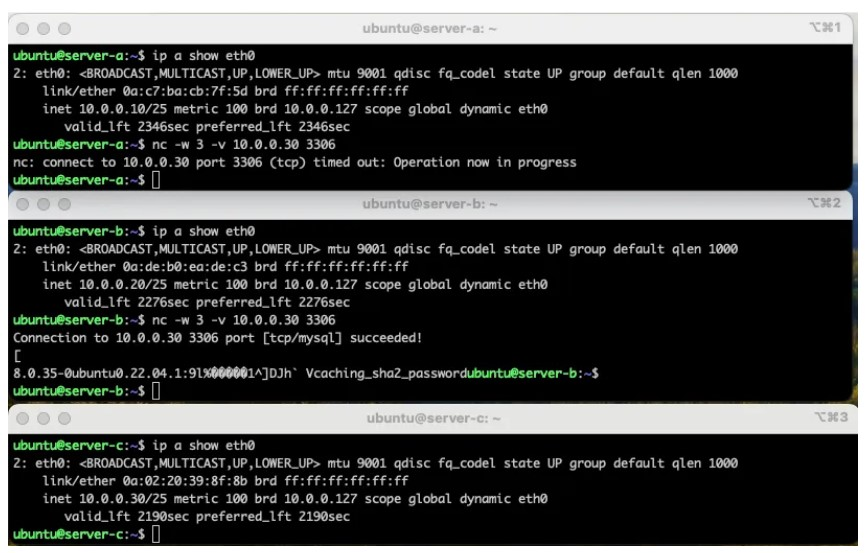
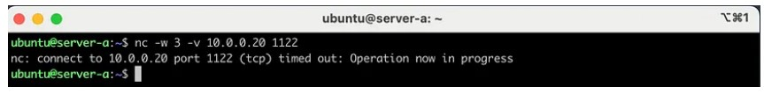

## 什么是NAT
NAT工作在网络层（第三层）上，它通过修改IP数据包的源IP地址和目标IP地址来实现地址转换。通常情况下，NAT是由网络设备（如路由器或防火墙）来执行的。

NAT有几种常见的形式，其中包括静态NAT、动态NAT和PAT（端口地址转换）。这些形式都是为了解决公共IP地址不足的问题，同时提供一种安全机制，隐藏内部网络的细节。
#### 目标网络地址转换（DNAT）
目标网络地址转换（Destination Network Address Translation，简称DNAT）是NAT的一种形式，它主要用于将外部请求的目标IP地址转换为内部网络中的特定IP地址。

DNAT通常用于提供服务器的外部访问，例如Web服务器或邮件服务器。当外部用户发送请求到公共IP地址时，DNAT会将请求的目标IP地址修改为服务器的内部IP地址，从而确保请求能够正确路由到服务器。

DNAT的配置通常在防火墙或路由器上进行，通过将目标IP地址和端口映射到内部网络中的特定IP地址和端口，实现请求的转发。

以下是一个DNAT的示例配置：
```
iptables -t nat -A PREROUTING -i eth0 -p tcp --dport 80 -j DNAT --to-destination 192.168.1.100:80
```
上述配置将所有通过eth0接口发送到端口80的TCP请求的目标IP地址转换为192.168.1.100，并将端口保持为80。

#### 源网络地址转换（SNAT）
源网络地址转换（Source Network Address Translation，简称SNAT）是NAT的另一种形式，它用于将内部网络中的源IP地址转换为公共网络可路由的IP地址。

SNAT通常用于实现多个内部设备共享一个公共IP地址访问互联网的情况。当内部设备发送请求到公共网络时，SNAT会将请求的源IP地址修改为公共IP地址，以确保响应能够正确返回到内部网络。

与DNAT类似，SNAT的配置通常也在防火墙或路由器上进行。以下是一个SNAT的示例配置：
```
iptables -t nat -A POSTROUTING -o eth0 -s 192.168.1.0/24 -j SNAT --to-source 203.0.113.10
```
上述配置将所有从192.168.1.0/24子网发送到外部网络的请求的源IP地址转换为203.0.113.10。

SNAT还可以配置为动态SNAT，其中IP地址会根据可用的公共IP地址池进行动态选择。这可以实现更好的负载均衡和高可用性。

#### DNAT和SNAT的区别
DNAT和SNAT之间的区别主要在于它们转换的地址类型不同。

DNAT将目标地址和端口号更改为不同的IP地址和端口号，以便路由器可以将数据包定向到正确的目标服务器。换句话说，DNAT将外部用户访问的公共IP地址转换为内部服务器的私有IP地址。因此，DNAT通常用于将公共IP地址和端口号映射到内部服务器上，以方便外部用户访问内部服务。

相反，SNAT将源IP地址更改为路由器的IP地址。当内部计算机访问外部资源时，路由器会更改数据包中的源IP地址以防止攻击。由于SNAT更改了源IP地址，因此目标服务器会认为请求它的计算机是路由器，而不是内部真实计算机。因此，SNAT通常用于网络安全和流量控制。

#### 为什么要进行连接跟踪
因为网关要进行SNAT，同时状态防火墙需要使用。

可以说，连接跟踪是DNAT/SNAT的基础。

假设客户端地址为192.168.15.100，一个去往223.5.5.5的请求从客户端发出。此时，经过逐跳路由后，最终会抵达网关。假设网关的出接口eth0为221.123.123.123。NAT的过程即是把192.168.15.100->223.5.5.5这个请求记录下来（连接跟踪），然后进行SNAT，把源地址（192.168.15.100）替换成221.123.123.123，然后转发出去，即转发出去时就成了221.123.123.123->223.5.5.5，因此，IPv4地址不够用，通过NAT就是这样缓解的。SNAT改变的是源地址，DNAT改变的是目的地址。

## 一个例子
源网络地址转换 (SNAT) 和目标网络地址转换 (DNAT) 是网络中的基础规则。SNAT 通常用于从私有网络到公共网络的流量。

DNAT 通常用于从公共网络到私有网络的流量。

这些是互联网上关于 SNAT 和 DNAT 的标准描述，通常是准确的。

现在我想用另一种更容易理解的方式来定义 SNAT 和 DNAT。

举个例子：

你有三个服务器： 服务器 A (10.0.0.10) 服务器 B (10.0.0.20) 服务器 C (10.0.0.30)

你无法控制服务器 C。 但是，服务器 A 和服务器 B 是你可以控制的。

服务器 C 上有一个监听 3306 端口的 MySQL 数据库。

服务器 A 可以访问服务器 B 的所有端口。 服务器 A 不能访问服务器 C 的任何端口。 服务器 C 的 3306 端口只能从服务器 B 访问。


服务器 A 能够访问服务器 C 的 3306 端口吗？ 是的，这要归功于 SNAT 和 DNAT。

在这种情况下，服务器 B 将作为服务器 A 的路由器。

由于服务器 B 将充当路由器，我们必须在服务器 B 上启用 IP 转发功能。

我们可以在服务器 B 上选择一个随机端口。服务器 A 将请求发送到服务器 B 的这个端口，而不是服务器 C 的 3306 端口。

假设：服务器 B 的 1122 端口

服务器 B 会将从 1122 端口接收到的流量转发到服务器 C 的 3306 端口。

iptables 规则如下：
```
iptables -t nat -A PREROUTING -p tcp --dport 1122 -j DNAT --to-destination 10.0.0.30:3306
```
nftables rule:
```
nft add rule ip nat PREROUTING tcp dport 1122 counter dnat to 10.0.0.30:3306
```
这个规则更改了流量的目的地（目标网络地址转换，DNAT）。

现在，让我们尝试从服务器 A 连接到服务器 B 的 1122 端口：

让我们通过 iptraf 来检查服务器 B 上的网络流量。前两行显示的是我的 SSH 连接，可以忽略它们。

可以看到从服务器 A (10.0.0.10) 到服务器 B (10.0.0.20) 的 1122 端口的流量。在列表底部，你可以看到指向服务器 C (10.0.0.30) 的流量。

这个请求是由服务器 A 向服务器 B 发出的。

为什么会超时？

问题在于，服务器 B 将转发流量的源 IP 设置为服务器 A 的 IP 地址，导致流量中断。

服务器 A 正在等待服务器 B 的响应，而服务器 C 应该将响应发送给服务器 B。

因此，我们必须更改服务器 B 上网络数据包的源 IP 地址。我们可以通过在服务器 B 上设置一个 SNAT（源网络地址转换）规则来实现这一点：
iptables rule:
```
iptables -t nat -A POSTROUTING -o eth0 -j SNAT --to-source 10.0.0.20
```
nftables rule:
```
nft add rule ip nat POSTROUTING oifname "eth0" counter snat to 10.0.0.20
```
Server A can connect to the MySQL server on Server C!


流量从 10.0.0.10（服务器 A）发送到 10.0.0.20（服务器 B）。其源 IP 在服务器 B 上被修改。修改后的流量从 10.0.0.20（服务器 B）发送到 10.0.0.30（服务器 C）。

这就是 SNAT 和 DNAT 的工作原理。