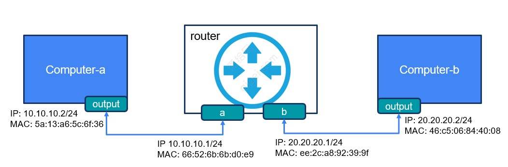
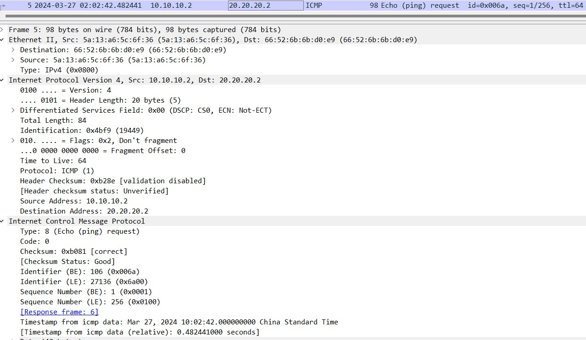
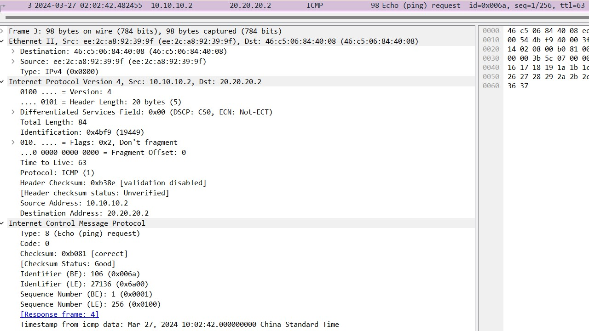

### 路由器转发数据包

路由器是网络中的设备，负责在不同的网络之间转发数据包。当路由器收到一个数据包时，它会执行以下步骤来处理并转发该数据包：

- 解析目标 IP 地址：路由器首先检查数据包的目标 IP 地址，以确定数据包应该被发送到哪个网络或主机。它会检查自己的路由表来查找与目标 IP 地址相匹配的路由条目。
- 查找最佳路径：路由器根据目标 IP 地址查找路由表，并确定到达目标网络或主机的最佳路径。最佳路径通常是通过评估路由表中的各个路由条目的权重和度量值来确定的。
- 更新MAC包头：在路由器转发数据包时，它还会修改数据包的 MAC 头部信息，以确保数据包在不同网络接口之间正确传递。具体来说，路由器会根据下一个网络接口或下一跳路由器的 MAC 地址来修改数据包的目标 MAC 地址，并会根据发送网络的MAC地址来修改MAC头中的source MAC 地址，并将其发送到正确的网络接口。
- 更新数据包的 TTL（生存时间）：路由器会递减数据包的 TTL 字段，并重新计算 IP 报文的校验和。这是为了确保数据包不会在网络中无限循环，避免造成网络拥塞。
- 转发数据包：路由器将数据包发送到下一个路由器或目标主机。如果数据包的目标主机就在路由器所连接的网络上，它将直接将数据包发送给目标主机。

#### 实验
我搭了下面的一个实验环境，尝试用ping操作来验证上面的理论是否正确。

- computer-a首先发送icmp echo request报文：

在IP包头中，src地址填的本地地址10.10.10.2，dst地址填了computer-b的地址，而在ether包头中，src MAC填了本地MAC，dst MAC填的是下一跳网关的MAC，也就是router的MAC地址。TTL是64，identification为0x4bf9。

- router收到computer-a发过来的icmp echo request报文后，先确认了ether 包头中的dst MAC是自己，并且TTL大于0，开始处理这个报文。
- router发现IP包头中的dst IP不是本地地址，开始查找本地路由表，以决定是继续转发或者丢弃。在路由表中查到20.20.20.0/24是接口b的网段，所以这个icmp echo request可以往接口b来转发。
- router修改了ether包头中的src MAC和dest MAC，分别填上本地发送端口b的MAC和computer-b的MAC地址。而对于IP包头，把TTL减少1，没有改变identification的值。这里需要注意的，IP包头中的checksum也被修改了（因为包头中有值被改变，所以checksum需要重新生成，ICMP包头中的checksum就没有改变）

