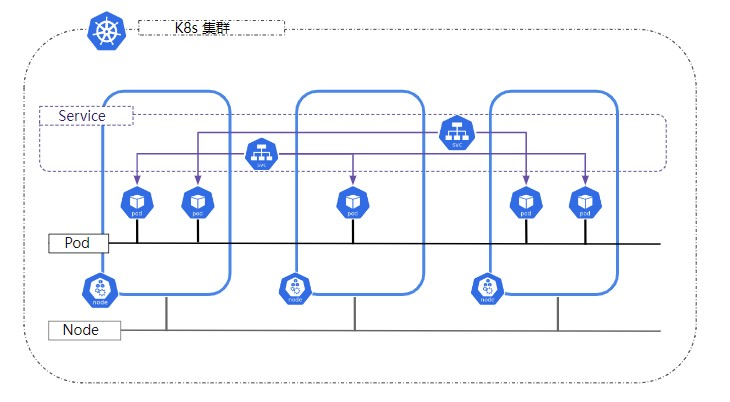

### 什么是K8s service
下图是一个简单的K8s cluster部署图，pod部署在不同的node中，每个pod都有被K8s CNI分配一个IP地址（在没有部署额外的多网络CNI的情况下，比如multus CNI），Kubernetes 假设 Pod 可与其它 Pod 通信，不管它们在哪个node上。 所以没必要在 Pod 与 Pod 之间创建连接或将容器的端口映射到主机端口。 这意味着同一个 Pod 内的所有容器能通过 localhost 上的端口互相连通，集群中的所有 Pod 只需要通过简单的路由，就能访问到彼此。



但如果某个节点宕机会发生什么呢？ Pod 会终止，pod控制器内的 ReplicaSet 将创建新的 Pod，并且重新分配一个 IP，那么刚才创建的pod和pod之间的网络连接就会中断。
如何解决这个问题呢？ Kubernetes Service 就被提出来了，它是集群中提供相同功能的一组 Pod 的抽象表达。 当每个 Service 创建时，会被分配一个唯一的 虚拟IP 地址（也称为 clusterIP）。 这个 IP 地址与 Service 的生命周期绑定在一起，只要 Service 存在，它就不会改变。 可以配置 Pod 使它与 Service 进行通信，Pod 与 Service 的通信将被自动地负载均衡到该 Service 中的某些 Pod 上。

#### service如何绑定pod
```
apiVersion: v1
kind: Service
metadata:
  name: my-service
spec:
  selector:
    app.kubernetes.io/name: MyApp
  type: ClusterIP
  ports:
    - protocol: TCP
      port: 80
      targetPort: 9376
```
上面的例子，系统将创建一个名为 "my-service" 的、 服务类型默认为 ClusterIP 的 Service。 该 Service 指向带有标签 app.kubernetes.io/name: MyApp 的所有 Pod 的 TCP 端口 9376。
Kubernetes 为该服务分配一个 IP 地址（称为 “service IP”），供虚拟 IP 地址机制使用。 

此 Service 的控制器不断扫描与其选择算符匹配的 Pod 集合，然后对 Service 的 EndpointSlice 集合执行必要的更新。
注意，pod和service的创建顺序没有强制要求。
#### 多端口 Service
对于某些 Service，你需要公开多个端口。Kubernetes 允许你为 Service 对象配置多个端口定义。 为 Service 使用多个端口时，必须为所有端口提供名称，以使它们无歧义。 例如：
```
apiVersion: v1
kind: Service
metadata:
  name: my-service
spec:
  selector:
    app.kubernetes.io/name: MyApp
  ports:
    - name: http
      protocol: TCP
      port: 80
      targetPort: 9376
    - name: https
      protocol: TCP
      port: 443
      targetPort: 9377
```

#### service 类型
可用的 type 值及其行为：
##### ClusterIP
service type的默认值，只能在k8s cluster内部访问，如果不指定spec.clusterIP字段， K8s会从service-cluster-ip-range CIDR 范围内给你的service分配一个未使用的service IP。
在创建 Service 的请求中，你可以通过设置 spec.clusterIP 字段来指定自己的集群 IP 地址。
你所选择的 IP 地址必须是合法的 IPv4 或者 IPv6 地址，并且这个 IP 地址在 API 服务器上所配置的 service-cluster-ip-range CIDR 范围内。

##### NodePort

如果你将 type 字段设置为 NodePort，则 Kubernetes 控制平面将在 --service-node-port-range 标志所指定的范围内分配端口（默认值：30000-32767）。 每个节点将该端口（每个节点上的相同端口号）上的流量代理到你的 Service。 你的 Service 在其 .spec.ports[*].nodePort 字段中报告已分配的端口。
这里要注意一点，必须保证kube-proxy服务正常运行，才能使NodePort服务生效。
对于 NodePort 服务，Kubernetes 额外分配一个端口（TCP、UDP 或 SCTP 以匹配 Service 的协议）。 集群中的每个节点都将自己配置为监听所分配的端口，并将流量转发到与该 Service 关联的某个就绪node。 通过使用合适的协议（例如 TCP）和适当的端口（分配给该 Service）连接到任何一个节点， 你就能够从集群外部访问 type: NodePort 服务。
###### 一个例子
```
apiVersion: v1
kind: Service
metadata:
  name: my-service
spec:
  type: NodePort
  selector:
    app: my-app
  ports:
    - protocol: TCP
      port: 8080
      targetPort: 80
      nodePort: 30000
```
在这个示例中，NodePort 类型的 Service 名称是 my-service，它会将流量转发到带有 app: my-app 标签的 Pod，通过节点的 30000 端口暴露服务。

现在，你可以通过任何cluster node的 IP 地址和指定的端口（在上面示例中为 30000）来访问 Service,不需要关系对应的Pod是部署在哪个node上。例如，假设你有一个节点的 IP 地址是 192.168.1.100，你可以通过 192.168.1.100:30000 来访问该 Service。
如果你有多个节点，每个节点都会将相同的端口暴露出去，因此你可以通过任何节点的 IP 地址和指定的端口来访问该 Service。这样，你就可以从集群外部访问该 Service。

##### LoadBalancer
这个类型的service需要cluster外部负载均衡器协同工作，一般不会用到。

##### ExternalName
类型为 ExternalName 的 Service 将 Service 映射到 DNS 名称，而不是通过spec.selector 映射到本地的Pod。

#### 无头服务（Headless Services）
有时你并不需要负载均衡，也不需要单独的 Service IP。遇到这种情况，可以通过显式设置 spec.clusterIP 的值为 "None" 来创建无头服务（Headless Service）。
无头 Service 不会获得集群 IP，kube-proxy 不会处理这类 Service， 而且平台也不会为它们提供负载均衡或路由支持。 取决于 Service 是否定义了绑定到Pod，DNS 会以不同的方式被自动配置：
- 绑定了Pod
Kubernetes 控制平面在 Kubernetes API 中创建 EndpointSlice 对象，并且修改 DNS 配置返回 A 或 AAAA 记录（IPv4 或 IPv6 地址）， 这些记录直接指向 Service 的后端 Pod 真实IP列表。

- 没绑定Pod
控制平面不会创建 EndpointSlice 对象。 然而 DNS 系统会执行以下操作之一：

    - 对于 type: ExternalName Service，查找和配置其 CNAME 记录；
    - 对所有其他类型的 Service，针对 Service 的就绪端点的所有 IP 地址，查找和配置 DNS A / AAAA 记录：
    - 对于 IPv4 端点，DNS 系统创建 A 记录。
    - 对于 IPv6 端点，DNS 系统创建 AAAA 记录。
当你定义这种类型的无头 Service 时，port 必须与 targetPort 相同。

#### 如何查找service对应的Pod IP
K8s用endpointslices来管理service对应的Pod IP：
```
[core@master0 cranuser2]$ oc get endpointslices.discovery.k8s.io -n openshift-dns dns-default-lc9cj -o json
    "metadata": {
        "labels": {
            "kubernetes.io/service-name": "dns-default"
        },
        "name": "dns-default-lc9cj"
    }
```
K8s 自动生成的 endpointslices 使用 "kubernetes.io/service-name" 标签来关联service，标签的值 "dns-default"就是一个service的名字。
```
[core@master0 cranuser2]$ oc get service -n openshift-dns dns-default
NAME          TYPE        CLUSTER-IP    EXTERNAL-IP   PORT(S)                  AGE
dns-default   ClusterIP   172.22.0.10   <none>        53/UDP,53/TCP,9154/TCP   64d
```
在 endpointslices 中，用 endpoint 字段来关联到实际的Pod的IP地址，这里的IP地址可以有多个，每个IP地址对应一个Pod，并且Pod 名字和 Pod部署的node信息都可以在endpoint 字段中查到。
```
endpoints:
- addresses:
  - 172.21.0.36
  nodeName: master0
  targetRef:
    kind: Pod
    name: dns-default-26cf7
```
默认情况下，一旦现有的 EndpointSlices 包含超过 100 个endpoint，K8s 就会创建一个新的 EndpointSlice.

#### 如何获得service对应的service IP
在pod内部，Kubernetes 支持两种查找服务的主要模式：环境变量和 DNS。前者开箱即用，而后者则需要 CoreDNS 集群插件。

#### Service 对应的 DNS条目
Service创建后，会在K8s cluster的DNS server中生成对应的DNS记录。
- A/AAAA 记录
    除了无头 Service 之外的 “普通” Service 会被赋予一个形如 my-svc.my-namespace.svc.cluster-domain.example 的 DNS A 和/或 AAAA 记录，取决于 Service 的 IP version设置。 该名称会解析成对应 Service 的集群 IP。

    没有集群 IP 的无头 Service 也会被赋予一个形如 my-svc.my-namespace.svc.cluster-domain.example 的 DNS A 和/或 AAAA 记录。 与普通 Service 不同，这一记录会被解析成对应 Service 所选择的 Pod IP 的集合。
    - 对于 IPv4 端点，DNS 系统创建 A 记录。
    - 对于 IPv6 端点，DNS 系统创建 AAAA 记录。

- SRV 记录
    Kubernetes 根据普通 Service 或无头 Service 中的命名端口创建 SRV 记录。每个命名端口， SRV 记录格式为 _port-name._port-protocol.my-svc.my-namespace.svc.cluster-domain.example。 普通 Service，该记录会被解析成端口号和域名。无头 Service，该记录会被解析成多个结果，及该服务的每个后端 Pod 各一个 SRV 记录。
##### 在node上查询DNS记录的例子
我的实验环境中创建了2个Pod，和2个service，其中一个service的类型是无头服务
```
[cranuser2@master0 zt]$ oc get pod -o wide
NAME       READY   STATUS        IP             NODE
node-a-0   1/1     Running      172.21.0.147   master0.hztt-ecp-10-70-30-210.ocp.hz.nsn-rdnet.net
node-b-0   1/1     Running      172.21.0.148   master0.hztt-ecp-10-70-30-210.ocp.hz.nsn-rdnet.net

[cranuser2@master0 zt]$ oc get service
NAME                  TYPE        CLUSTER-IP      EXTERNAL-IP   PORT(S)
my-service            ClusterIP   172.22.33.210   <none>        80/TCP
my-service-headless   ClusterIP   None            <none>        1000/TCP
```

首先来看一下pod中的DNS resolv文件：
```
[root@node-a-0:/]
# cat /etc/resolv.conf
search cran2.svc.cluster.local svc.cluster.local cluster.local hztt-ecp-10-70-30-210.ocp.hz.nsn-rdnet.net
nameserver 172.22.0.10
options ndots:5
```
从这儿可以看到，在当前namespace中，所有pod的DNS记录的域名后缀是 cran2.svc.cluster.local。

因为是在node上访问K8s的DNS服务，不能使用K8s提供的DNS service IP，我们需要知道DNS Pod的真实IP和服务端口，通过下面这个命令获得：
```
[core@master0 cranuser2]$ oc get endpointslices.discovery.k8s.io  -A | grep dns
NAMESPACE              NAME                 ADDRESSTYPE   PORTS                        ENDPOINTS
openshift-dns        dns-default-lc9cj      IPv4          5353,9154,5353               172.21.0.36
```

DNS Pod的IP是172.21.0.36，服务端口是5353.
先来查询普通service的DNS记录：
```
[core@master0 cranuser2]$ dig @172.21.0.36 -p 5353 my-service.cran2.svc.cluster.local

; <<>> DiG 9.16.23-RH <<>> @172.21.0.36 -p 5353 my-service.cran2.svc.cluster.local
; (1 server found)
;; global options: +cmd

;; QUESTION SECTION:
;my-service.cran2.svc.cluster.local. IN A

;; ANSWER SECTION:
my-service.cran2.svc.cluster.local. 5 IN A      172.22.33.210
```
可以看到，在K8s cluster中，为普通service my-service创建了一个A的DNS记录，完整的DNS域名为my-service.cran2.svc.cluster.local（service-name + 域名后缀），对应的IP地址是service IP（cluster IP）。

那么对于无头服务，我们再来看看会生成怎么样的DNS记录：
```
[core@master0 cranuser2]$ dig @172.21.0.36 -p 5353 my-service-headless.cran2.svc.cluster.local

; <<>> DiG 9.16.23-RH <<>> @172.21.0.36 -p 5353 my-service-headless.cran2.svc.cluster.local
; (1 server found)
;; global options: +cmd
;; QUESTION SECTION:
;my-service-headless.cran2.svc.cluster.local. IN        A

;; ANSWER SECTION:
my-service-headless.cran2.svc.cluster.local. 5 IN A 172.21.0.147
my-service-headless.cran2.svc.cluster.local. 5 IN A 172.21.0.148
```
无头服务不分配service IP，所以DNS记录里面保存的是Pod的真实IP，因为my-service-headless对应的Pod有2个实体，所以这里有2个A DNS记录。

#### service IP是如何工作的
每当我们在k8s cluster中创建一个service，k8s cluster就会在K8s cluster IP的范围内为service分配一个cluster-ip，比如本文开始时提到的：
```
# kubectl get services
NAME           CLUSTER-IP      EXTERNAL-IP   PORT(S)     AGE
index-api      192.168.3.168   <none>        30080/TCP   18d
kubernetes     192.168.3.1     <none>        443/TCP     94d
my-nginx       192.168.3.179   <nodes>       80/TCP      90d
nginx-kit      192.168.3.196   <nodes>       80/TCP      12d
rbd-rest-api   192.168.3.22    <none>        8080/TCP    60d
```

这个cluster-ip只是一个虚拟的ip，并不真实绑定某个物理网络设备或虚拟网络设备，仅仅存在于iptables的规则中：
```
Chain PREROUTING (policy ACCEPT)
target         prot opt source               destination
KUBE-SERVICES  all  --  0.0.0.0/0            0.0.0.0/0            /* kubernetes service portals */
```
可以看到在PREROUTING环节，k8s设置了一个target: KUBE-SERVICES，这个链的source和destination都是0.0.0.0，表示所有的数据包都要经过这个链。
```
# iptables -t nat -nL|grep 192.168.3
Chain KUBE-SERVICES (2 references)
target                     prot opt source               destination
KUBE-SVC-XGLOHA7QRQ3V22RZ  tcp  --  0.0.0.0/0            192.168.3.182        /* kube-system/kubernetes-dashboard: cluster IP */ tcp dpt:80
KUBE-SVC-NPX46M4PTMTKRN6Y  tcp  --  0.0.0.0/0            192.168.3.1          /* default/kubernetes:https cluster IP */ tcp dpt:443
KUBE-SVC-AU252PRZZQGOERSG  tcp  --  0.0.0.0/0            192.168.3.22         /* default/rbd-rest-api: cluster IP */ tcp dpt:8080
KUBE-SVC-TCOU7JCQXEZGVUNU  udp  --  0.0.0.0/0            192.168.3.10         /* kube-system/kube-dns:dns cluster IP */ udp dpt:53
KUBE-SVC-BEPXDJBUHFCSYIC3  tcp  --  0.0.0.0/0            192.168.3.179        /* default/my-nginx: cluster IP */ tcp dpt:80
KUBE-SVC-UQG6736T32JE3S7H  tcp  --  0.0.0.0/0            192.168.3.196        /* default/nginx-kit: cluster IP */ tcp dpt:80
KUBE-SVC-ERIFXISQEP7F7OF4  tcp  --  0.0.0.0/0            192.168.3.10         /* kube-system/kube-dns:dns-tcp cluster IP */ tcp dpt:53
```
而KUBE-SERVICES下面又设置了许多target，一旦destination和dstport匹配，就会沿着chain进行处理。
比如：当我们在pod网络curl 192.168.3.22:8080时，匹配到下面的KUBE-SVC-AU252PRZZQGOERSG target：
```
KUBE-SVC-AU252PRZZQGOERSG  tcp  --  0.0.0.0/0            192.168.3.22         /* default/rbd-rest-api: cluster IP */ tcp dpt:8080
```

沿着target，我们看到”KUBE-SVC-AU252PRZZQGOERSG”对应的内容如下：
```
Chain KUBE-SVC-AU252PRZZQGOERSG (1 references)
target     prot opt source               destination
KUBE-SEP-I6L4LR53UYF7FORX  all  --  0.0.0.0/0            0.0.0.0/0            /* default/rbd-rest-api: */ statistic mode random probability 0.50000000000
KUBE-SEP-LBWOKUH4CUTN7XKH  all  --  0.0.0.0/0            0.0.0.0/0            /* default/rbd-rest-api: */
```
这里KUBE-SVC-AU252PRZZQGOERSG里有2个target，表示当前的service有2个实体pod来负责业务处理。
```
Chain KUBE-SEP-I6L4LR53UYF7FORX (1 references)
target     prot opt source               destination
KUBE-MARK-MASQ  all  --  172.16.99.6          0.0.0.0/0            /* default/rbd-rest-api: */
DNAT       tcp  --  0.0.0.0/0            0.0.0.0/0            /* default/rbd-rest-api: */ tcp to:172.16.99.6:8080

Chain KUBE-SEP-LBWOKUH4CUTN7XKH (1 references)
target     prot opt source               destination
KUBE-MARK-MASQ  all  --  172.16.99.7          0.0.0.0/0            /* default/rbd-rest-api: */
DNAT       tcp  --  0.0.0.0/0            0.0.0.0/0            /* default/rbd-rest-api: */ tcp to:172.16.99.7:8080
```
请求被按5：5开的比例分发（起到负载均衡的作用）到KUBE-SEP-I6L4LR53UYF7FORX 和KUBE-SEP-LBWOKUH4CUTN7XKH。
```
Chain KUBE-MARK-MASQ (17 references)
target     prot opt source               destination
MARK       all  --  0.0.0.0/0            0.0.0.0/0            MARK or 0x4000
```
而这两个chain的处理方式都是一样的，那就是先做mark，然后做dnat，将service ip改为service对应的Pod中的Pod IP，这样请求被实际传输到pod中处理了。