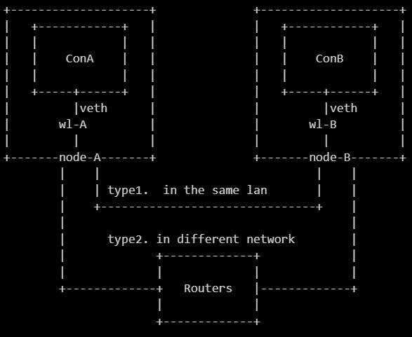
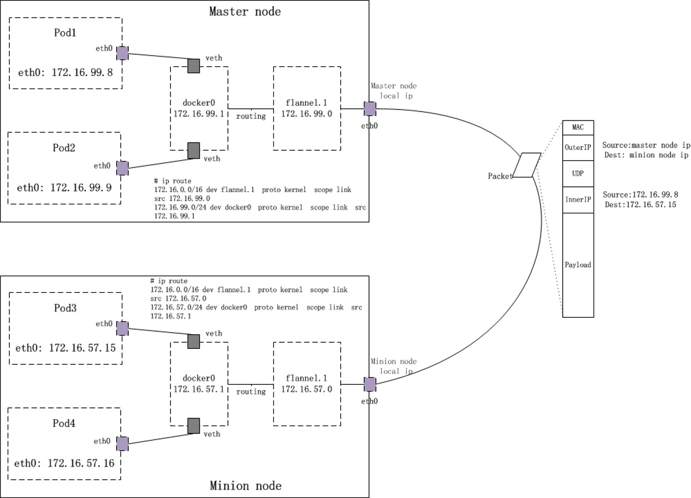
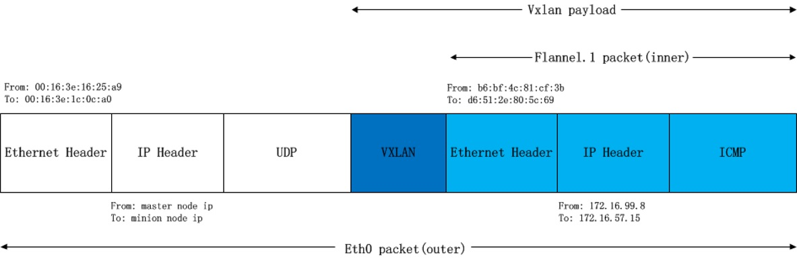

# 第三方CNI介绍

## Calico
它是一个 L3/L4 网络解决方案，
- 数据平面选择：支持 eBPF、标准 Linux、Windows 和 VPP，实现网络解决方案的多样性。
- 优化性能：专为高速度和低 CPU 使用率设计，最大化集群投资回报。
- 可扩展架构：在扩展 Kubernetes 集群时无缝增长，且不牺牲性能。
- 高级安全性：提供细粒度的访问控制和 WireGuard 加密。
- Kubernetes 网络策略支持：不断定义并支持 Kubernetes 网络策略标准的卓越性。
- 灵活的网络功能：提供多种网络工具，包括 BGP、VXLAN、服务广告等。

calico是一个比较有趣的虚拟网络解决方案，完全利用 路由规则实现动态组网，通过BGP协议通告路由。

calico的好处是endpoints组成的网络是单纯的三层网络，报文的流向完全通过路由规则控制，没有overlay等额外开销。

calico的endpoint可以漂移，并且实现了acl。

calico的缺点是路由的数目与容器数目相同，非常容易超过 路由器、三层交换、甚至node的处理能力，从而限制了整个网络的扩张。

calico的每个node上会设置大量（海量)的iptables规则、路由，运维、排障难度大。

calico的原理决定了它不可能支持VPC，容器只能从calico设置的网段中获取ip。

calico目前的实现没有流量控制的功能，会出现少数容器抢占node多数带宽的情况。

calico的网络规模受到BGP网络规模的限制。

#### calico组件
- Felix：Calico 的主要代理，在每个托管端点的机器上运行，负责编程和维护数据平面的路由和防火墙规则。
- etcd：数据存储，用于保存 Calico 的网络配置和状态信息，确保集群中所有节点共享相同的网络视图。
- BIRD：一个 BGP 客户端，用于分发路由信息，将网络拓扑更新传播到集群中的其他节点。
- BGP 路由反射器 (BIRD)：可选的 BGP 路由反射器，适用于需要更高扩展性的环境，简化了大规模集群中的路由信息分发。
- 编排器插件：编排器特定的代码，用于将 Calico 与特定的编排器（如 Kubernetes、OpenShift 等）深度集成，实现网络策略和流量管理的无缝协作。

#### Calico 组网原理

calico组网的核心原理就是IP 路由，每个容器或者虚拟机会分配一个workload-endpoint(wl)。
从nodeA上的容器A内访问nodeB上的容器B时:


从ConA中发送给ConB的报文被nodeA的wl-A接收，根据nodeA上的路由规则，经过各种iptables规则后，转发到nodeB。
如果nodeA和nodeB在同一个二层网段，下一条地址直接就是node-B，经过二层交换机即可到达。
如果nodeA和nodeB在不同的网段，报文被路由到下一跳，经过三层交换或路由器，一步步跳转到node-B。
核心问题是，nodeA怎样得知下一跳的地址？答案是node之间通过BGP协议交换 路由信息。
每个node上运行一个软路由软件bird，并且被设置成BGP Speaker，与其它node通过BGP协议交换路由信息。

#### calico 运行流程
当容器创建时，calico为容器生成veth pair，一端作为容器网卡加入到容器的网络命名空间，并设置IP和掩码，一端直接暴露在宿主机上，并通过设置路由规则，将容器IP暴露到宿主机的通信路由上。于此同时，calico为每个主机分配了一段子网作为容器可分配的IP范围，这样就可以根据子网的CIDR为每个主机生成比较固定的路由规则。
当容器需要跨主机通信时，主要经过下面的简单步骤：
1）容器流量通过veth pair到达宿主机的网络命名空间上。
2）根据容器要访问的IP所在的子网CIDR和主机上的路由规则，找到下一跳要到达的宿主机IP。
3）流量到达下一跳的宿主机后，根据当前宿主机上的路由规则，直接到达对端容器的veth pair插在宿主机的一端，最终进入容器。
从上面的通信过程来看，跨主机通信时，整个通信路径完全没有使用NAT或者UDP封装，性能上的损耗确实比较低。但由于calico的通信机制是完全基于三层的，这种机制也带来了一些缺陷，例如：
1）calico目前只支持TCP、UDP、ICMP、ICMPv6协议，如果使用其他四层协议（例如NetBIOS协议），建议使用weave、原生overlay等其他overlay网络实现。
2）基于三层实现通信，在二层上没有任何加密包装，因此只能在私有的可靠网络上使用。

详细信息参考这个文档： https://www.lijiaocn.com/%E9%A1%B9%E7%9B%AE/2017/04/11/calico-usage.html

## Flannel

Flannel 是一个覆盖网络工具，旨在简化容器的 IP 地址管理。它为网络中的每个主机分配一个子网地址范围，通常使用 IPv4，并采用 /24 或 /16 子网掩码来为容器分配 IP 地址。

Flannel 最初是为 Kubernetes 创建的，但也可以作为通用的覆盖网络，在 Kubernetes 之外的环境中运行。通过为每个主机配置一个 IP 范围和子网大小，并利用 etcd 进行子网与主机的映射，Flannel 可以帮助在多个容器主机上部署分布式系统，如 Hadoop，从而解决 Docker 原生 IP 分配机制的局限性。


在平坦的flannel network中，每个pod都会被分配唯一的ip地址，且每个k8s node的subnet各不重叠，没有交集。不过这样的subnet分配模型也有一定弊端，那就是可能存在ip浪费：一个node上有200多个flannel ip地址(xxx.xxx.xxx.xxx/24)，如果仅仅启动了几个Pod，那么其余ip就处于闲置状态。

#### 通信过程
如上图所示，我们来看看从pod1：172.16.99.8发出的数据包是如何到达pod3：172.16.57.15的（比如：在pod1的某个container中ping -c 3 172.16.57.15）。
##### a) 从Pod出发
由于k8s更改了docker的DOCKER_OPTS，显式指定了–bip，这个值与分配给该node上的subnet的范围是一致的。这样一来，docker引擎每次创建一个Docker container，该container被分配到的ip都在flannel subnet范围内。
当我们在Pod1下的某个容器内执行ping -c 3 172.16.57.15，数据包便开始了它在flannel network中的旅程。
Pod是Kubernetes调度的基本unit。Pod内的多个container共享一个network namespace。kubernetes在创建Pod时，首先先创建pause容器，然后再以pause的network namespace为基础，创建pod内的其他容器（–net=container:xxx），这样Pod内的所有容器便共享一个network namespace，这些容器间的访问直接通过localhost即可。比如Pod下A容器启动了一个服务，监听8080端口，那么同一个Pod下面的另外一个B容器通过访问localhost:8080即可访问到A容器下面的那个服务。
我们看一下Pod1中某Container内的路由信息：
```
# docker exec ba75f81455c7 ip route
default via 172.16.99.1 dev eth0
172.16.99.0/24 dev eth0  proto kernel  scope link  src 172.16.99.8
```
目的地址172.16.57.15并不在直连网络中，因此数据包通过default路由出去。default路由的路由器地址是172.16.99.1，也就是上面的docker0 bridge的IP地址。相当于docker0 bridge以“三层的工作模式”直接接收到来自容器的数据包(而并非从bridge的二层端口接收)。

##### b) docker0与flannel.1之间的包转发
数据包到达docker0后，docker0的内核栈处理程序发现这个数据包的目的地址是172.16.57.15，并不是真的要送给自己，于是开始为该数据包找下一hop。根据master node上的路由表：
master node：
```
# ip route
... ...
172.16.0.0/16 dev flannel.1  proto kernel  scope link  src 172.16.99.0
172.16.99.0/24 dev docker0  proto kernel  scope link  src 172.16.99.1
... ...
```
我们匹配到“172.16.0.0/16”这条路由！这是一条直连路由，数据包被直接送到flannel.1设备上。
##### c) flannel.1设备以及flanneld的功用
flannel.1是否会重复docker0的套路呢：包不是发给自己，转发数据包？会，也不会。
“会”是指flannel.1肯定要将包转发出去，因为毕竟包不是给自己的（包目的ip是172.16.57.15, vxlan设备ip是172.16.99.0）。
 “不会”是指flannel.1不会走寻常套路去转发包，因为它是一个vxlan类型的设备，也称为vtep，virtual tunnel end point。
那么它到底是怎么处理数据包的呢？这里涉及一些Linux内核对vxlan处理的内容，详细内容可参见本文末尾的参考资料。
flannel.1收到数据包后，由于自己不是目的地，也要尝试将数据包重新发送出去。数据包沿着网络协议栈向下流动，在二层时需要封二层以太包，填写目的mac地址，这时一般应该发出arp：”who is 172.16.57.15″。但vxlan设备的特殊性就在于它并没有真正在二层发出这个arp包，因为下面的这个内核参数设置：
master node:
```
# cat /proc/sys/net/ipv4/neigh/flannel.1/app_solicit
3
```
而是由linux kernel引发一个”L3 MISS”事件并将arp请求发到用户空间的flanned程序。
flanned程序收到”L3 MISS”内核事件以及arp请求(who is 172.16.57.15)后，并不会向外网发送arp request，而是尝试从etcd查找该地址匹配的子网的vtep信息。在前面章节我们曾经展示过etcd中Flannel network的配置信息：
master node:
```
# etcdctl --endpoints http://127.0.0.1:{etcd listen port} ls  /coreos.com/network/subnets
/coreos.com/network/subnets/172.16.99.0-24
/coreos.com/network/subnets/172.16.57.0-24
```

```
# curl -L http://127.0.0.1:{etcd listen port}/v2/keys/coreos.com/network/subnets/172.16.57.0-24
{"action":"get","node":{"key":"/coreos.com/network/subnets/172.16.57.0-24","value":"{\"PublicIP\":\"{minion node local ip}\",\"BackendType\":\"vxlan\",\"BackendData\":{\"VtepMAC\":\"d6:51:2e:80:5c:69\"}}","expiration":"2017-01-17T09:46:20.607339725Z","ttl":21496,"modifiedIndex":2275460,"createdIndex":2275460}}
```
flanneld从etcd中找到了答案：
subnet: 172.16.57.0/24
public ip: {minion node local ip}
VtepMAC: d6:51:2e:80:5c:69

我们查看minion node上的信息，发现minion node上的flannel.1 设备mac就是d6:51:2e:80:5c:69：
minion node:
```
#ip -d link show

349: flannel.1: <BROADCAST,MULTICAST,UP,LOWER_UP> mtu 1450 qdisc noqueue state UNKNOWN mode DEFAULT group default
    link/ether d6:51:2e:80:5c:69 brd ff:ff:ff:ff:ff:ff promiscuity 0
    vxlan id 1 local 10.46.181.146 dev eth0 port 0 0 nolearning ageing 300
```
接下来，flanned将查询到的信息放入master node host的arp cache表中：
master node:
```
#ip n |grep 172.16.57.15
172.16.57.15 dev flannel.1 lladdr d6:51:2e:80:5c:69 REACHABLE
```
flanneld完成这项工作后，linux kernel就可以在arp table中找到 172.16.57.15对应的mac地址并封装二层以太包了。


##### d) kernel的vxlan封包
我们需要将上述的packet从master node传输到minion node，需要将上述packet再次封包。这个任务在backend为vxlan的flannel network中由linux kernel来完成。
flannel.1为vxlan设备，linux kernel可以自动识别，并将上面的packet进行vxlan封包处理。在这个封包过程中，kernel需要知道该数据包究竟发到哪个node上去。kernel需要查看node上的fdb(forwarding database)以获得上面对端vtep设备（已经从arp table中查到其mac地址：d6:51:2e:80:5c:69）所在的node地址。如果fdb中没有这个信息，那么kernel会向用户空间的flanned程序发起”L2 MISS”事件。flanneld收到该事件后，会查询etcd，获取该vtep设备对应的node的”Public IP“，并将信息注册到fdb中。
这样Kernel就可以顺利查询到该信息并封包了：
master node:
```
# bridge fdb show dev flannel.1|grep d6:51:2e:80:5c:69
d6:51:2e:80:5c:69 dst {minion node local ip} self permanent
```
由于目标ip是minion node，查找路由表，包应该从master node的eth0发出，这样src ip和src mac地址也就确定了。封好的包示意图如下：


##### e) kernel的vxlan拆包
minion node上的eth0接收到上述vxlan包，kernel将识别出这是一个vxlan包，于是拆包后将flannel.1 packet转给minion node上的vtep（flannel.1）。minion node上的flannel.1再将这个数据包转到minion node上的docker0，继而由docker0传输到Pod3的某个容器里。

#### Flannel 的关键特性包括：

- 简单的覆盖网络：采用覆盖网络方式虚拟连接节点，使容器网络地址的设置和管理更加简便。
- 灵活的 IP 地址管理：为每个主机分配一个 IP 子网（默认 /24），实现高效的 IP 分配，这对扩展应用程序至关重要。
- 与 Kubernetes 的兼容性：与 Kubernetes 集成，使集群内每个节点都有自己的子网，提升网络组织和效率。
- 使用 etcd 进行协调：依赖 etcd 保持已分配子网与实际主机 IP 地址之间的一致映射，确保网络配置的准确性。
- 通过 UDP 传输数据：使用 UDP 封装并传输 IP 数据报至远程主机，实现不同主机间容器的通信。
- 支持分布式系统：为部署跨多个容器主机的复杂多主机系统提供可靠的网络结构，克服 Docker 原生的局限。
- Kubernetes 服务集成：与 Kubernetes 配合，分配服务 IP 并管理流量路由，确保即使节点或 Pod 被替换，服务仍然可用。